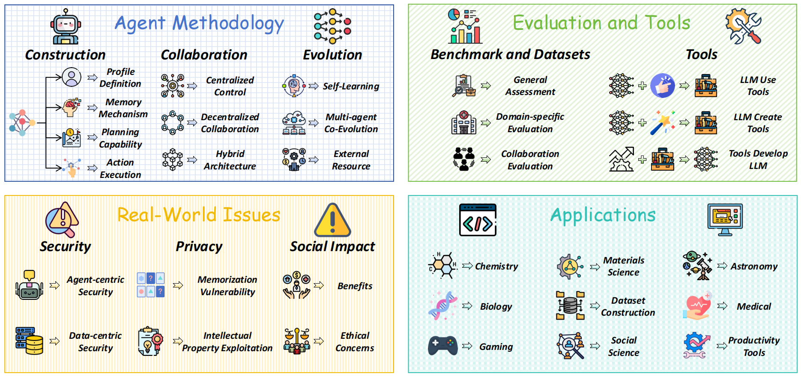

# 🤖 Comprehensive LLM Agent Research Collection

<div align="center">


[](https://github.com/luo-junyu/Awesome-Agent-Papers/commits/main)
[](https://github.com/luo-junyu/Awesome-Agent-Papers/pulls)

</div>

<p align="center">
  
</p>

## 🌟 Overview

This repository contains a **comprehensive collection** of research papers on Large Language Model (LLM) agents. We organize papers across key categories including agent construction, collaboration mechanisms, evolution, tools, security, benchmarks, and applications.

Our taxonomy provides a structured framework for understanding the rapidly evolving field of LLM agents, from architectural foundations to practical implementations. The repository bridges fragmented research threads by highlighting connections between agent design principles and emergent behaviors.

📄 **[Read our survey paper here](https://arxiv.org/abs/2503.21460)**


## 📊 Statistics & Trends

Our survey covers the rapidly evolving field of LLM agents, with a significant increase in research publications since 2023.


<p align="center">
  
  
</p>

## 📑 Table of Contents

- [Overview](#-overview)
- [Statistics & Trends](#-statistics--trends)
- [Key Categories](#-key-categories)
- [Resource List](#-resource-list)
- [Contributing](#-contributing)
- [Citation](#-citation)

## 🔍 Key Categories

- **Agent Construction**: Methodologies and architectures for building LLM agents
- **Agent Collaboration**: Frameworks for multi-agent interaction and cooperation
- **Agent Evolution**: Self-improvement and learning capabilities of agents
- **Tools**: Integration of external tools and APIs with LLM agents
- **Security**: Security concerns and protections for LLM agent systems
- **Benchmarks**: Evaluation frameworks and datasets for testing agent capabilities
- **Applications**: Real-world implementations and use cases


## 📚 Resource List
| Title | Section_or_Category | Year | TLDR | url |
| --- | --- | --- | --- | --- |
| Foam-Agent: Towards Automated Intelligent CFD Workflows | Agent Collaboration | 2025 | The paper presents Foam - Agent, a multi - agent framework automating CFD workflows from natural language. It features unique retrieval, file - generation and error - correction systems, lowering expertise barriers.  | [link](https://arxiv.org/abs/2505.04997) |
| Why Do Multi-Agent LLM Systems Fail?  | Agent Collaboration | 2025 | Presents MAST, a taxonomy for MAS failures. Develops an LLM-as-a-Judge pipeline, and opensources data to guide MAS development.  | [link](https://arxiv.org/abs/2503.13657) |
| Linear formation control of multi-agent systems | Agent Collaboration | 2025 | A new distributed leader–follower control architecture (linear formation control) is proposed for formation variations, with new concepts and estimation methods.  | [link](https://www.sciencedirect.com/science/article/pii/S0005109824004291) |
| MultiAgentBench: Evaluating the Collaboration and Competition of LLM agents | Agent Collaboration | 2025 | Introduces MultiAgentBench to evaluate LLM - based multi - agent systems. Assesses collaboration and competition, evaluates protocols and strategies, code & data open - sourced.  | [link](https://arxiv.org/abs/2503.01935) |
| A Survey of AI Agent Protocols | Agent Collaboration | 2025 | Paper analyzes existing LLM agent protocols, proposes a classification, explores future directions for next - gen protocols.  | [link](https://arxiv.org/abs/2504.16736) |
| Adaptive Collaboration Strategy for LLMs in Medical Decision Making | Agent Collaboration | 2024 | Proposes Medical Decisionmaking Agents (MDAgents) to assign LLM collaboration structures, adapting to task complexity and exploring group consensus.  | [link](https://arxiv.org/abs/2404.15155) |
| ReConcile: Round-Table Conference Improves Reasoning via Consensus among Diverse LLMs | Agent Collaboration | 2024 | Proposes ReConcile, a multi - model multi - agent framework like a round - table conference, enhancing LLM collaborative reasoning via discussion and voting.  | [link](https://arxiv.org/abs/2309.13007) |
| MetaGPT: Meta Programming for A Multi-Agent Collaborative Framework | Agent Collaboration | 2024 | Introduces MetaGPT, a meta - programming framework integrating human workflows into LLM - based multi - agent systems, improving task breakdown and error reduction.  | [link](https://arxiv.org/abs/2308.00352) |
| Debating with More Persuasive LLMs Leads to More Truthful Answers | Agent Collaboration | 2024 | The paper explores if weaker models can assess stronger ones via debate. It shows debate helps non - experts and optimising debaters aids truth - finding without ground truth.  | [link](https://arxiv.org/abs/2402.06782) |
| Roco: Dialectic multi-robot collaboration with large language models | Agent Collaboration | 2024 | Proposes using pre - trained LLMs for multi - robot high - level comm. and low - level path planning, with in - context improvement, and introduces RoCoBench.  | [link](https://arxiv.org/abs/2307.04738) |
| AutoAct: Automatic Agent Learning from Scratch for QA via Self-Planning | Agent Collaboration | 2024 | AutoAct is an automatic QA agent learning framework. It synthesizes trajectories without external help and uses labor - division for task completion.  | [link](https://arxiv.org/abs/2401.05268) |
| Meta-Prompting: Enhancing Language Models with Task-Agnostic Scaffolding | Agent Collaboration | 2024 | Introduces meta - prompting, a task - agnostic scaffolding to turn one LM into a multi - role system, integrates external tools, enhancing task performance.  | [link](https://arxiv.org/abs/2401.12954) |
| Encouraging Divergent Thinking in Large Language Models through Multi-Agent Debate | Agent Collaboration | 2024 | The paper proposes a Multi - Agent Debate framework to solve the DoT problem in LLMs, encouraging divergent thinking for complex tasks.  | [link](https://arxiv.org/abs/2305.19118) |
| AgentVerse: Facilitating Multi-Agent Collaboration and Exploring Emergent Behaviors | Agent Collaboration | 2024 | The paper proposes AgentVerse, a multi - agent framework inspired by human group dynamics, facilitating collaboration and revealing emergent behaviors in agents.  | [link](https://openreview.net/forum?id=EHg5GDnyq1) |
| Dynamic LLM-Powered Agent Network for Task-Oriented Agent Collaboration | Agent Collaboration | 2024 | Proposes DyLAN, a framework for LLM - powered agent collaboration. It uses two - stage paradigm with agent selection and dynamic collaboration for various tasks.  | [link](https://arxiv.org/abs/2310.02170) |
| ChatDev: Communicative Agents for Software Development | Agent Collaboration | 2024 | This paper presents ChatDev, a chat - powered framework. Specialized LLM agents collaborate via unified linguistic comm., bridging phases for autonomous task - solving.  | [link](https://arxiv.org/abs/2307.07924) |
| ChatEval: Towards Better LLM-based Evaluators through Multi-Agent Debate | Agent Collaboration | 2024 | The paper presents ChatEval, a multi - agent referee team, leveraging multi - agent debate for text evaluation, offering a human - mimicking process.  | [link](https://openreview.net/forum?id=FQepisCUWu) |
| A Dynamic LLM-Powered Agent Network for Task-Oriented Agent Collaboration | Agent Collaboration | 2024 | This paper proposes DyLAN, a framework for LLM - powered agent collaboration. It selects agents dynamically and uses a two - stage paradigm for task - solving.  | [link](https://openreview.net/forum?id=XII0Wp1XA9#discussion) |
| AutoGen: Enabling Next-Gen LLM Applications via Multi-Agent Conversation | Agent Collaboration | 2023 | AutoGen is an open - source framework enabling LLM app building with multi - agent conversation, customizable agents, and flexible interaction definition.  | [link](https://arxiv.org/abs/2308.08155) |
| Improving Factuality and Reasoning in Language Models through Multiagent Debate | Agent Collaboration | 2023 | A multi - agent debate approach is presented to improve LLMs' reasoning and factuality, applicable to black - box models with a unified procedure.  | [link](https://arxiv.org/abs/2305.14325) |
| Autonomous chemical research with large language models | Agent Collaboration | 2023 | The paper introduces Coscientist, an AI system driven by GPT - 4. It integrates tools, shows potential in research, and demonstrates AI's versatility and efficacy.  | [link](https://www.nature.com/articles/s41586-023-06792-0) |
| Planning with Multi-Constraints via Collaborative Language Agents | Agent Construction | 2025 | This paper proposes PMC, a zero - shot method for LLM - based multi - agent systems. It simplifies complex, constraint - heavy task planning via task decomposition.  | [link](https://aclanthology.org/2025.coling-main.672/) |
| Embodied Agent Interface: Benchmarking LLMs for Embodied Decision Making | Agent Construction | 2025 | The paper proposes an Embodied Agent Interface to unify tasks, modules, and metrics, comprehensively assessing LLMs for embodied decision making.  | [link](https://proceedings.neurips.cc/paper_files/paper/2024/hash/b631da756d1573c24c9ba9c702fde5a9-Abstract-Datasets_and_Benchmarks_Track.html) |
| SPeCtrum: A Grounded Framework for Multidimensional Identity Representation in LLM-Based Agent  | Agent Construction | 2025 | Introduces SPeCtrum, a framework integrating S, P, C for LLM agent personas. Enhances identity realism, enabling personalized AI interactions.  | [link](https://arxiv.org/abs/2502.08599) |
| Adaptive Thinking via Mode Policy Optimization for Social Language Agents | Agent Construction | 2025 | Proposes Adaptive Mode Learning (AML) framework and AMPO algorithm, offering multi - granular modes, context - aware switching, and token - efficient reasoning.  | [link](https://arxiv.org/pdf/2505.02156) |
| On Architecture of LLM agents  | Agent Construction | 2025 | The paper discusses LLM agent architecture. Agents are a key area in AI, acting like mashups and robots, and frameworks can simplify their creation.  | [link](http://www.injoit.ru/index.php/j1/article/view/2057) |
| AutoAgents: A Framework for Automatic Agent Generation | Agent Construction | 2024 | Introduces AutoAgents, a framework generating and coordinating specialized agents per task. Incorporates an observer. Offers new complex - task - tackling perspectives.  | [link](https://arxiv.org/abs/2309.17288) |
| MetaGPT: Meta Programming for A Multi-Agent Collaborative Framework | Agent Construction | 2024 | MetaGPT is a meta - programming framework integrating human workflows into LLM - based multi - agent collaborations, streamlining workflows and reducing errors.  | [link](https://arxiv.org/abs/2308.00352) |
| Cognitive Architectures for Language Agents | Agent Construction | 2024 | Proposes CoALA, a framework for language agents with modular memory, action space, and decision - making, organizing work and guiding future development.  | [link](https://arxiv.org/abs/2309.02427) |
| Executable Code Actions Elicit Better LLM Agents | Agent Construction | 2024 | This work proposes CodeAct using executable Python code for LLM agents, unifying action space, and builds an open - source agent with a tuned dataset.  | [link](https://arxiv.org/abs/2402.01030) |
| ChatDev: Communicative Agents for Software Development | Agent Construction | 2024 | The paper introduces ChatDev, an LLM - powered framework enabling agents to collaborate via language for software design, coding, and testing, unifying phases.  | [link](https://arxiv.org/abs/2307.07924) |
| Editable Scene Simulation for Autonomous Driving via Collaborative LLM-Agents | Agent Construction | 2024 | This paper presents ChatSim, enabling editable 3D driving scene sims via NLP. It uses LLM - agent, new neural radiance field and lighting estimation methods.  | [link](https://openaccess.thecvf.com/content/CVPR2024/papers/Wei_Editable_Scene_Simulation_for_Autonomous_Driving_via_Collaborative_LLM-Agents_CVPR_2024_paper.pdf) |
| A Dynamic LLM-Powered Agent Network for Task-Oriented Agent Collaboration | Agent Construction | 2024 | A framework named DyLAN is proposed for LLM - powered agent collaboration. It has a two - stage paradigm with dynamic agent selection and communication for tasks.  | [link](https://arxiv.org/abs/2310.02170) |
| More Agents Is All You Need | Agent Construction | 2024 | The paper proposes Agent Forest, a sampling - and - voting method. It's orthogonal to existing ones, enhancing LLMs with performance correlated to task difficulty.  | [link](https://arxiv.org/abs/2402.05120) |
| Agent Hospital: A Simulacrum of Hospital with Evolvable Medical Agents | Agent Construction | 2024 | Presents Agent Hospital, a hospital simulacrum with LLM - powered agents. Doctor agents evolve without manual labeling, and methods benefit broader apps.  | [link](https://arxiv.org/abs/2405.02957) |
| Empowering biomedical discovery with AI agents | Agent Construction | 2024 | Paper proposes “AI scientists” as collaborative agents integrating AI and bio - tools. They combine human and AI abilities and impact multiple bio - areas.  | [link](https://www.cell.com/cell/fulltext/S0092-8674(24)01070-5?&target=_blank) |
| SMART-LLM: Smart Multi-Agent Robot Task Planning using Large Language Models | Agent Construction | 2024 | Proposes SMART-LLM, an LLM - based framework for multi - robot task planning. Creates a benchmark dataset and offers resources on https://sites.google.com/view/smart-llm/.  | [link](https://ieeexplore.ieee.org/abstract/document/10802322) |
| Perceive, Reflect, and Plan: Designing LLM Agent for Goal-Directed City Navigation without Instructions | Agent Construction | 2024 | The paper presents a novel LLM agent workflow with perception, reflection, and planning for goal - directed city navigation, avoiding baseline drawbacks.  | [link](http://arxiv.org/abs/2408.04168) |
| Enhancing the General Agent Capabilities of Low-Parameter LLMs through Tuning and Multi-Branch Reasoning | Agent Construction | 2024 | Proposes constructing agent - specific data with GPT - 4 and fine - tuning small - parameter LLMs. Multi - path reasoning and task decomposition improve agent performance.  | [link](https://arxiv.org/abs/2403.19962) |
| PlanCritic: Formal Planning with Human Feedback | Agent Construction | 2024 | Presents a feedback - driven plan critic, optimizing plans via RL with human feedback and GA, bridging gaps in planner research.  | [link](https://arxiv.org/abs/2412.00300) |
| Enhancing Robot Task Planning: Integrating Environmental Information and Feedback Insights through Large Language Models | Agent Construction | 2024 | Presents EnviroFeedback Planner, integrating environmental info into prompt building and feedback for better agent execution in task planning.  | [link](https://ieeexplore.ieee.org/abstract/document/10661782) |
| Devil's Advocate: Anticipatory Reflection for LLM Agents | Agent Construction | 2024 | A novel approach equips LLM agents with introspection, prompting task decomposition, continuous self - assessment, and three - fold intervention for better consistency and adaptability.  | [link](https://arxiv.org/abs/2405.16334) |
| Planning, Creation, Usage: Benchmarking LLMs for Comprehensive Tool Utilization in Real-World Complex Scenarios | Agent Construction | 2024 | Presents UltraTool, a benchmark for LLMs in real - world tool use. It evaluates the whole process, independently assesses planning, and removes pre - defined toolset restrictions.  | [link](https://arxiv.org/abs/2401.17167) |
| CAMEL: Communicative Agents for "Mind" Exploration of Large Language Model Society | Agent Construction | 2023 | Proposes a role - playing communicative agent framework, offers scalable study approach for multi - agent systems, and open - sources library.  | [link](https://arxiv.org/abs/2303.17760) |
| AutoGen: Enabling Next-Gen LLM Applications via Multi-Agent Conversation | Agent Construction | 2023 | AutoGen is an open - source framework for LLM apps. It enables customizable multi - agent conversation, flexible programming, and building diverse apps.  | [link](https://arxiv.org/abs/2308.08155) |
| AgentCoder: Multi-Agent-based Code Generation with Iterative Testing and Optimisation | Agent Construction | 2023 | The paper introduces AgentCoder, a multi - agent framework for code generation. It addresses balancing issues and outperforms existing methods.  | [link](https://arxiv.org/abs/2312.13010) |
| War and Peace (WarAgent): Large Language Model-based Multi-Agent Simulation of World Wars | Agent Construction | 2023 | Proposes WarAgent, an LLM - powered multi - agent system for simulating historical conflicts, offering new insights for conflict resolution and peacekeeping.  | [link](https://arxiv.org/abs/2311.17227) |
| Describe, Explain, Plan and Select: Interactive Planning with LLMs Enables Open-World Multi-Task Agents | Agent Construction | 2023 | The paper studies Minecraft planning for multi - task agents. It identifies two challenges and proposes a method to address inefficient planning.  | [link](https://proceedings.neurips.cc/paper_files/paper/2023/hash/6b8dfb8c0c12e6fafc6c256cb08a5ca7-Abstract-Conference.html) |
| TPTU: Large Language Model-based AI Agents for Task Planning and Tool Usage | Agent Construction | 2023 | Presents a framework for LLM - based AI agents, designs two agent types, evaluating TPTU abilities to guide LLM use in AI apps.  | [link](https://arxiv.org/abs/2308.03427) |
| Evolutionary optimization of model merging recipes  | Agent Evolution | 2025 | Proposes an evolutionary approach for model merging, operating in two spaces, enabling cross - domain merging and introducing a new model composition paradigm.  | [link](https://www.nature.com/articles/s42256-024-00975-8) |
| CREAM: Consistency Regularized Self-Rewarding Language Models | Agent Evolution | 2025 | This paper formulates a framework for self - rewarding LLM, introduces regularization, and proposes CREAM to use reward consistency for more reliable data.  | [link](https://openreview.net/pdf?id=Vf6RDObyEF) |
| KnowAgent: Knowledge-Augmented Planning for LLM-Based Agents  | Agent Evolution | 2025 | The paper presents KNOWAGENT, using action knowledge base and self - learning to enhance LLM planning and mitigate hallucinations.  | [link](https://arxiv.org/pdf/2403.03101) |
| Benchmark Self-Evolving: A Multi-Agent Framework for Dynamic LLM Evaluation | Agent Evolution | 2024 | A benchmark self - evolving multi - agent framework extends benchmarks, uses six operations for fine - grained LLM evaluation, aiding model selection.  | [link](https://arxiv.org/pdf/2402.11443) |
| Agent-Pro: Learning to Evolve via Policy-Level Reflection and Optimization | Agent Evolution | 2024 | Proposes Agent-Pro, an LLM-based agent using policy-level reflection and optimization. It evolves via dynamic belief process and DFS for better policies.  | [link](https://aclanthology.org/2024.acl-long.292.pdf) |
| Coevolving with the Other You: Fine-Tuning LLM with Sequential Cooperative Multi-Agent Reinforcement Learning | Agent Evolution | 2024 | The paper proposes CORY, extending LLM fine - tuning to a multi - agent framework. Agents coevolve, potentially superior to PPO for real - world refinement.  | [link](https://proceedings.neurips.cc/paper_files/paper/2024/file/1c2b1c8f7d317719a9ce32dd7386ba35-Paper-Conference.pdf) |
| A Survey on Self-Evolution of Large Language Models | Agent Evolution | 2024 | Presents a framework for LLM self - evolution with four phases. Categorizes objectives, summarizes literature, and points out challenges and future directions.  | [link](https://arxiv.org/pdf/2404.14387) |
| LLM-Evolve: Evaluation for LLM’s Evolving Capability on Benchmarks | Agent Evolution | 2024 | This paper proposes LLM-Evolve, an innovative framework extending benchmarks to sequential settings, enabling LLMs to learn from past experiences.  | [link](https://aclanthology.org/2024.emnlp-main.940.pdf) |
| CRITIC: Large Language Models Can Self-Correct with Tool-Interactive Critiquing | Agent Evolution | 2024 | The paper introduces CRITIC, a framework enabling LLMs to self - correct via tool interaction, highlighting external feedback's role in LLMs' self - improvement.  | [link](https://openreview.net/pdf?id=Sx038qxjek) |
| Iterative Translation Refinement with Large Language Models  | Agent Evolution | 2024 | The paper proposes iterative prompting of LLMs for self - correcting translations. It emphasizes source - anchoring and shows improved human - perceived quality.  | [link](https://aclanthology.org/2024.eamt-1.17.pdf) |
| Agent Alignment in Evolving Social Norms  | Agent Evolution | 2024 | Proposes EvolutionaryAgent, an evolutionary framework for agent alignment. Transforms alignment into evolution/selection, applicable to various LLMs.  | [link](https://arxiv.org/pdf/2401.04620) |
| Mitigating the Alignment Tax of RLHF  | Agent Evolution | 2024 | The paper reveals alignment tax in RLHF. It proposes HMA via model averaging to balance alignment and forgetting, maximizing performance with minimal tax.  | [link](https://aclanthology.org/2024.emnlp-main.35.pdf) |
| Self-Rewarding Language Models  | Agent Evolution | 2024 | Paper studies Self - Rewarding LMs using LLM - as - a - Judge to self - reward during training, opening door for continuous improvement.  | [link](https://arxiv.org/pdf/2401.10020) |
| V-STaR: Training Verifiers for Self-Taught Reasoners  | Agent Evolution | 2024 | Proposes V - STaR to train a verifier using both correct and incorrect self - generated solutions, improving solution selection and reasoning ability.  | [link](https://openreview.net/pdf?id=stmqBSW2dV) |
| RLCD: Reinforcement learning from contrastive distillation for LM alignment | Agent Evolution | 2024 | Proposes RLCD, a method for LM alignment without human feedback. Creates preference pairs via contrasting prompts to train a preference model.  | [link](https://openreview.net/pdf?id=v3XXtxWKi6) |
| LANGUAGE MODEL SELF-IMPROVEMENT BY REIN- FORCEMENT LEARNING CONTEMPLATION  | Agent Evolution | 2024 | This paper presents RLC, a novel LMSI method leveraging evaluation - generation gap. It improves models without supervision and has broad applicability.  | [link](https://openreview.net/pdf?id=38E4yUbrgr) |
| ProAgent: Building Proactive Cooperative Agents with Large Language Models  | Agent Evolution | 2024 | Proposes ProAgent, an LLM - based framework for proactive agents. It can adapt behavior, analyze states, infer intentions, and is modular, address zero - shot issues.  | [link](https://ojs.aaai.org/index.php/AAAI/article/view/29710/31219) |
| Agent Planning with World Knowledge Model  | Agent Evolution | 2024 | Presents parametric World Knowledge Model (WKM) for agent planning, synthesizing knowledge and guiding global & local planning, shows unique potential.  | [link](https://openreview.net/pdf?id=j6kJSS9O6I) |
| Refining Guideline Knowledge for Agent Planning Using Textgrad  | Agent Evolution | 2024 | This paper introduces Textgrad to optimize Guideline Knowledge for agents' embodied tasks, enabling auto - optimization via text gradients and failed trajectory analysis.  | [link](https://www.computer.org/csdl/proceedings-article/ickg/2024/088200a102/24sKrMSCxr2) |
| Encouraging Divergent Thinking in Large Language Models through Multi-Agent Debate | Agent Evolution | 2024 | This paper proposes a Multi - Agent Debate framework to solve the Degeneration - of - Thought problem in LLMs, encouraging divergent thinking.  | [link](https://arxiv.org/abs/2305.19118) |
| LLMs in the Imaginarium: Tool Learning through Simulated Trial and Error | Agent Evolution | 2024 | Existing LLMs' tool - use accuracy is low. A novel simulated trial - and - error method is proposed, inspired by biological systems, for better tool learning.  | [link](https://aclanthology.org/2024.acl-long.570/) |
| AlpacaFarm: A Simulation Framework for Methods that Learn from Human Feedback  | Agent Evolution | 2023 | AlpacaFarm addresses challenges in LLM development. It simulates feedback cheaply, offers evaluation and method implementations, validating end - to - end.  | [link](https://proceedings.neurips.cc/paper_files/paper/2023/file/5fc47800ee5b30b8777fdd30abcaaf3b-Paper-Conference.pdf) |
| SELF-REFINE:  Iterative Refinement with Self-Feedback  | Agent Evolution | 2023 | Introduces SELF - REFINE, an approach for iterative LLM output refinement without extra training, demonstrating test - time improvement of LLMs.  | [link](https://openreview.net/pdf?id=S37hOerQLB) |
| Self-Evolution Learning for Discriminative Language Model Pretraining | Agent Evolution | 2023 | Presents Self - Evolution learning (SE), a method for token masking and learning. Exploits data knowledge and uses novel smoothing, improving linguistic learning.  | [link](https://aclanthology.org/2023.findings-acl.254.pdf) |
| Self-Evolved Diverse Data Sampling for Efficient Instruction Tuning  | Agent Evolution | 2023 | The paper introduces DIVERSEEVOL, a self-evolving mechanism for label-efficient instruction tuning, enhancing data diversity without human/LLM intervention.  | [link](https://arxiv.org/pdf/2311.08182) |
| SELFEVOLVE: A Code Evolution Framework via Large Language Models  | Agent Evolution | 2023 | Proposes SELF-EVOLVE, a two - step pipeline using LLMs as knowledge providers and self - reflective programmers, with no need for special test cases.  | [link](https://arxiv.org/pdf/2306.02907) |
| SELF-INSTRUCT: Aligning Language Models with Self-Generated Instructions  | Agent Evolution | 2023 | Introduces SELF - INSTRUCT, a framework to boost language models' instruction - following via self - generated samples, almost annotation - free.  | [link](https://aclanthology.org/2023.acl-long.754.pdf) |
| Large Language Models are Better Reasoners with Self-Verification  | Agent Evolution | 2023 | The paper proposes LLMs have self - verification abilities. It uses backward verification, taking CoT conclusions as conditions, to improve reasoning performance.  | [link](https://aclanthology.org/2023.findings-emnlp.167.pdf) |
| CODET: CODE GENERATION WITH GENERATED TESTS  | Agent Evolution | 2023 | The paper proposes CODET, a method using pre - trained LMs to auto - generate test cases for code samples, facilitating better solution selection.  | [link](https://openreview.net/pdf?id=ktrw68Cmu9c) |
| Evolving Diverse Red-team Language Models in Multi-round Multi-agent Games  | Agent Evolution | 2023 | Introduces dynamic Red Team Game to analyze multi - round interactions, develops GRTS to mitigate mode collapse, paves way for LLM safety.  | [link](https://arxiv.org/pdf/2310.00322) |
| Improving Factuality and Reasoning in Language Models through Multiagent Debate | Agent Evolution | 2023 | A multi - agent debate approach for LLMs is proposed. It enhances reasoning, factuality, is applicable to black - box models, and has potential for LLM advancement.  | [link](https://arxiv.org/abs/2305.14325) |
| CAMEL: Communicative Agents for "Mind" Exploration of Large Language Model Society | Agent Evolution | 2023 | Paper proposes role - playing framework for autonomous agent cooperation, offers scalable study approach, and open - sources library.  | [link](https://arxiv.org/pdf/2303.17760) |
| STaR: Self-Taught Reasoner Bootstrapping Reasoning With Reasoning  | Agent Evolution | 2022 | Proposes STaR, a technique leveraging few rationale examples and rationale - free data to bootstrap complex reasoning, letting models learn from self - generated reasoning.  | [link](https://openreview.net/pdf?id=_3ELRdg2sgI) |
| An active inference strategy for prompting reliable responses from large language models in medical practice | Applications | 2025 | The paper proposes a domain-specific dataset and an active inference-based prompting protocol to address LLM issues, enabling its safe medical integration.  | [link](https://doi.org/10.1038/s41746-025-01516-2) |
| An evaluation framework for clinical use of large language models in patient interaction tasks | Applications | 2025 | Presents CRAFT - MD, an approach using natural dialogues for LLM clinical evaluation. Proposes recommendations for future LLM eval to enhance medical practice.  | [link](https://doi.org/10.1038/s41591-024-03328-5) |
| Large Language Models lack essential metacognition for reliable medical reasoning | Applications | 2025 | Developed MetaMedQA to evaluate models' metacognition in medical reasoning, revealing deficiencies, emphasizing need for metacognition - based frameworks.  | [link](https://doi.org/10.1038/s41467-024-55628-6) |
| Balancing autonomy and expertise in autonomous synthesis laboratories | Applications | 2025 | Comment on barriers in autonomous synthesis labs, propose human on - the - loop approach, and strategies for optimizing labs' features.  | [link](https://doi.org/10.1038/s43588-025-00769-x) |
| SimUSER: Simulating User Behavior with Large Language Models for Recommender System Evaluation | Applications | 2025 | Introduces SimUSER, an agent framework using personas for cost - effective user simulation in recommender system eval., refines params for real - world engagement.  | [link](https://arxiv.org/pdf/2504.12722) |
| Swarm Autonomy: From Agent Functionalization to Machine Intelligence  | Applications | 2025 | This review summarizes synthetic swarms from agent basics to applications, discussing emergent machine intelligence for real - world autonomous swarm design.  | [link](https://advanced.onlinelibrary.wiley.com/doi/full/10.1002/adma.202312956) |
| ShowUI: One Vision-Language-Action Model for GUI Visual Agent  | Applications | 2025 | A vision-language-action model for GUI visual agents with UI-guided token selection, interleaved streaming, and curated datasets advances GUI assistance.  | [link](https://openaccess.thecvf.com/content/CVPR2025/html/Lin_ShowUI_One_Vision-Language-Action_Model_for_GUI_Visual_Agent_CVPR_2025_paper.html) |
| Agent Laboratory: Using LLM Agents as Research Assistants | Applications | 2025 | The paper introduces Agent Laboratory, an LLM - based framework for full - cycle research. It reduces costs, and user feedback improves quality, accelerating discovery.  | [link](https://arxiv.org/abs/2501.04227) |
| Towards Scientific Intelligence: A Survey of LLM-based Scientific Agents | Applications | 2025 | The paper reviews LLM - based scientific agents, highlights differences from general agents, and offers a roadmap for scientific discovery.  | [link](https://arxiv.org/abs/2503.24047) |
| Motif: Intrinsic Motivation from Artificial Intelligence Feedback | Applications | 2024 | Paper proposes Motif, a method to interface LLM prior knowledge with agents via intrinsic rewards, yielding intuitive behaviors and progress on tough tasks.  | [link](https://arxiv.org/pdf/2310.00166) |
| Baba Is AI: Break the Rules to Beat the Benchmark | Applications | 2024 | This paper likely presents a novel approach in action games under “Applications” section, with potential rule - breaking strategies for agents.  | [link](https://arxiv.org/pdf/2407.13729) |
| Large language model-empowered agents for simulating macroeconomic activities | Applications | 2024 | This paper uses large language model-empowered agents to simulate macro - economic activities, offering a novel approach in economic applications.  | [link](https://aclanthology.org/2024.acl-long.829/) |
| CompeteAI: Understanding the Competition Dynamics in Large Language Model-based Agents | Applications | 2024 | The paper focuses on competition dynamics in LLMs-based agents in Economy applications, offering novel insights for the field.  | [link](https://arxiv.org/abs/2310.17512) |
| Understanding the benefits and challenges of using large language model-based conversational agents for mental well-being support | Applications | 2024 | The paper explores benefits and challenges of large language model - based conversational agents for mental well - being support in psychology applications.  | [link](https://pmc.ncbi.nlm.nih.gov/articles/PMC10785945/) |
| Exploring Collaboration Mechanisms for LLM Agents | Applications | 2024 | This paper explores collaboration mechanisms for LLM agents in the psychology applications, bringing novel ideas to large model - based agents.  | [link](https://aclanthology.org/2024.acl-long.782/) |
| Simulating Human Society with Large Language Model Agents: City, Social Media, and Economic System | Applications | 2024 | The paper applies large language model agents to simulate human society, covering city, social media, and economic systems, a novel contribution in the field.  | [link](https://dl.acm.org/doi/10.1145/3589335.3641253) |
| Can large language models transform computational social science? | Applications | 2024 | Paper explores if large language models can transform computational social science in social applications, offering novel insights.  | [link](https://aclanthology.org/2024.cl-1.8/) |
| AgentCF: Collaborative Learning with Autonomous Language Agents for Recommender Systems | Applications | 2024 | Proposes AgentCF to simulate user-item interactions. Considers users and items as agents, uses collaborative learning to model two-sided relations, inspiring behavior simulation.  | [link](https://arxiv.org/pdf/2310.09233) |
| On Generative Agents in Recommendation | Applications | 2024 | Proposes Agent4Rec, an LLM - empowered user simulator for recommenders with profile, memory, and action modules, exploring human behavior simulation.  | [link](https://arxiv.org/abs/2310.10108) |
| ChatDev: Communicative Agents for Software Development | Applications | 2024 | Introduces ChatDev, a chat - powered dev framework. LLMs agents use unified language comm. in design, coding, testing, bridging phases via lang. https://github.com/OpenBMB/ChatDev  | [link](https://aclanthology.org/2024.acl-long.810/) |
| CRISPR-GPT: An LLM Agent for Automated Design of Gene-Editing Experiments | Applications | 2024 | Introduces CRISPR - GPT, an LLM agent with domain knowledge and tools for auto - designing gene - editing experiments, addresses ethics, bridges researcher - technique gap.  | [link](https://arxiv.org/abs/2404.18021) |
| SciAgents: Automating Scientific Discovery Through Bioinspired Multi-Agent Intelligent Graph Reasoning | Applications | 2024 | SciAgents uses ontological KGs, LLMs, and multi - agent systems to uncover interdisciplinary relations in biomaterials, autonomously generating and refining hypotheses for discovery.  | [link](https://advanced.onlinelibrary.wiley.com/doi/full/10.1002/adma.202413523) |
| Medical large language models are susceptible to targeted misinformation attacks | Applications | 2024 | The paper reveals LLMs in medicine are vulnerable. Just 1.1% weight manipulation can inject incorrect facts, stressing need for security measures.  | [link](https://doi.org/10.1038/s41746-024-01282-7) |
| Describe, Explain, Plan and Select: Interactive Planning with Large Language Models Enables Open-World Multi-Task Agents  | Applications | 2023 | Paper proposes “DEPS”, an interactive planning approach with LLMs for multi - task agents, refining plans and showing effectiveness across domains.  | [link](https://arxiv.org/pdf/2302.01560) |
| Language Models Meet World Models: Embodied Experiences Enhance Language Models | Applications | 2023 | Combines language & world models, using embodied experiences. Applicable in simulation games, enhancing model capabilities.  | [link](https://arxiv.org/abs/2305.10626.pdf) |
| ChessGPT: Bridging Policy Learning and Language Modeling | Applications | 2023 | The paper bridges policy learning and language modeling, with potential applications in competition games, offering a novel approach in large model - based agents.  | [link](https://proceedings.neurips.cc/paper_files/paper/2023/hash/16b14e3f288f076e0ca73bdad6405f77-Abstract-Datasets_and_Benchmarks.html) |
| Mindagent: Emergent gaming interaction | Applications | 2023 | This paper explores emergent gaming interaction in cooperation games, presenting novel applications for large model - based agents.  | [link](https://arxiv.org/pdf/2309.09971) |
| Exploring large language models for communication games: An empirical study on Werewolf | Applications | 2023 | This paper empirically explores large language models in Werewolf, a communication game, contributing novel applications in this area.  | [link](https://arxiv.org/abs/2309.04658) |
| Language as reality: a co-creative storytelling game experience in 1001 nights using generative AI | Applications | 2023 | This paper presents a co - creative storytelling game in "1001 Nights" via generative AI, contributing fresh application in game generation.  | [link](https://ojs.aaai.org/index.php/AIIDE/article/view/27539) |
| TradingGPT: Multi-Agent System with Layered Memory and Distinct Characters for Enhanced Financial Trading Performance | Applications | 2023 | TradingGPT presents a multi - agent system with layered memory and distinct characters to boost financial trading performance, a novel approach in the field.  | [link](https://arxiv.org/abs/2309.03736) |
| Using large language models to simulate multiple humans and replicate human subject studies | Applications | 2023 | The paper applies large language models to simulate humans for replicating subject studies, contributing novel methods in psychological applications.  | [link](https://proceedings.mlr.press/v202/aher23a/aher23a.pdf) |
| Generative Agents: Interactive Simulacra of Human Behavior | Applications | 2023 | Paper presents generative agents simulating human behavior, with novelty in application to society, a potential addition to large model - based agents study.  | [link](https://arxiv.org/abs/2304.03442) |
| Self-collaboration Code Generation via ChatGPT | Applications | 2023 | A self - collaboration framework for code generation using LLMs like ChatGPT is proposed. It forms virtual teams of agents, improving complex task handling without human intervention.  | [link](https://arxiv.org/abs/2304.07590) |
| Language models can solve computer tasks | Applications | 2023 | The paper presents RCI, a simple prompting scheme enabling pre - trained LLMs to execute computer tasks via natural language, enhancing reasoning and outperforming other methods.  | [link](https://openreview.net/pdf?id=M6OmjAZ4CX) |
| ChemCrow: Augmenting large-language models with chemistry tools | Applications | 2023 | Introduces ChemCrow, an LLM chemistry agent integrating 18 tools. Augments LLM in chemistry, automates tasks, and bridges experimental and computational chemistry.  | [link](https://arxiv.org/abs/2304.05376) |
| AlphaFlow: autonomous discovery and optimization of multi-step chemistry using a self-driven fluidic lab guided by reinforcement learning | Applications | 2023 | The paper presents AlphaFlow, a self - driven fluidic lab using reinforcement learning for multi - step chemistry discovery, demonstrating its potential for new synthetic routes beyond cALD.  | [link](https://www.nature.com/articles/s41467-023-37139-y) |
| Language Models as Zero-Shot Planners: Extracting Actionable Knowledge for Embodied Agents | Applications | 2022 | This paper presents language models as zero - shot planners for embodied agents, with applications in simulation games, offering actionable knowledge extraction novelty.  | [link](https://proceedings.mlr.press/v162/huang22a.html) |
| Stress-testing the resilience of the Austrian healthcare system using agent-based simulation | Applications | 2022 | A data - driven agent - based framework quantifies regional healthcare resilience to shocks, helps identify care access bottlenecks and relates systemic to individual indicators.  | [link](https://doi.org/10.1038/s41467-022-31766-7) |
| AgentHarm: Benchmarking Robustness of LLM Agents on Harmful Tasks | Datasets & Benchmarks | 2025 | Proposes AgentHarm, a new benchmark for LLM agents' robustness. Covers 11 harm categories, enabling evaluation of attacks and defenses.  | [link](https://openreview.net/pdf?id=AC5n7xHuR1) |
| AI Hospital: Benchmarking Large Language Models in a Multi-agent Medical Interaction Simulator | Datasets & Benchmarks | 2025 | Introduced AI Hospital for simulating medical interactions, developed MVME benchmark, proposed dispute - resolution mechanism to boost LLMs' clinical abilities.  | [link](https://aclanthology.org/2025.coling-main.680.pdf) |
| Benchmark Self-Evolving: A Multi-Agent Framework for Dynamic LLM Evaluation | Datasets & Benchmarks | 2025 | A multi - agent benchmark self - evolving framework dynamically evaluates LLMs. It reframes instances and extends datasets, aiding model selection and benchmark evolution.  | [link](https://aclanthology.org/2025.coling-main.223.pdf) |
| DCA-Bench: A Benchmark for Dataset Curation Agents | Datasets & Benchmarks | 2025 | The paper sets up a benchmark for LLM agents to detect wild dataset issues, curates test cases, and proposes an evaluation framework, promoting real - world curation.  | [link](https://openreview.net/pdf?id=a4sknPttwV) |
| MedAgentBench: A Realistic Virtual EHR Environment to Benchmark Medical LLM Agents | Datasets & Benchmarks | 2025 | The paper introduces MedAgentBench, a benchmark for medical LLM agents with clinically - derived tasks and realistic data, enabling evaluation and optimization in medical domain.  | [link](https://arxiv.org/pdf/2501.14654) |
| MLE-Bench: Evaluating Machine Learning Agents on Machine Learning Engineering | Datasets & Benchmarks | 2025 | Introduced MLE - bench for evaluating AI agents in ML engineering. Curated tasks, set baselines, evaluated models, and opened - sourced code for future research.  | [link](https://openreview.net/pdf?id=6s5uXNWGIh) |
| EgoLife: Towards Egocentric Life Assistant | Datasets & Benchmarks | 2025 | Introduced EgoLife project for egocentric life assistant. Created EgoLife Dataset and EgoLifeQA tasks for daily life assistance.  | [link](https://arxiv.org/pdf/2503.03803) |
| DSBench: How Far Are Data Science Agents to Becoming Data Science Experts?  | Datasets & Benchmarks | 2025 | The paper introduces DSBench, a comprehensive benchmark for data science agents with realistic tasks, bridging the gap between benchmarks and real - world apps.  | [link](https://arxiv.org/abs/2409.07703) |
| Towards Internet-Scale Training For Agents  | Datasets & Benchmarks | 2025 | The paper develops a pipeline for Internet-scale agent training without extensive human annotations, with LLMs handling task gen., execution, and review.  | [link](https://arxiv.org/abs/2502.06776) |
| AgentBench: Evaluating LLMs as Agents | Datasets & Benchmarks | 2024 | Presents AgentBench with 8 environments to evaluate LLM agents, identifies failure reasons, and offers improvement strategies like multi - round alignment training.  | [link](https://openreview.net/pdf?id=zAdUB0aCTQ) |
| AgentQuest: A Modular Benchmark Framework to Measure Progress and Improve LLM Agents | Datasets & Benchmarks | 2024 | Proposes AgentQuest, a framework with modular benchmarks/metrics and two new evaluation metrics for tracking LLM agent progress.   | [link](https://aclanthology.org/2024.naacl-demo.19.pdf) |
| BENCHAGENTS: Automated Benchmark Creation with Agent Interaction | Datasets & Benchmarks | 2024 | Introduces BENCHAGENTS, an LLM - based framework to automate benchmark creation for complex capabilities, ensuring data quality with agent interaction and human feedback.  | [link](https://arxiv.org/pdf/2410.22584) |
| Benchmarking Data Science Agents | Datasets & Benchmarks | 2024 | Presents DSEval, a novel evaluation paradigm and benchmarks for data science agents, with a bootstrapped method for better coverage and comprehensiveness.  | [link](https://aclanthology.org/2024.acl-long.308.pdf) |
| Benchmarking Large Language Models as AI Research Agents | Datasets & Benchmarks | 2024 | Proposes MLAgent-Bench for benchmarking AI research agents, designs an LLM-based agent, and identifies key challenges for such agents.  | [link](https://openreview.net/pdf?id=N9wD4RFWY0) |
| Benchmarking Large Language Models for Multi-agent Systems: A Comparative Analysis of AutoGen, CrewAI, and TaskWeaver | Datasets & Benchmarks | 2024 | The paper benchmarks three LLMs-powered multi - agent systems (AutoGen, CrewAI, TaskWeaver) on ML code gen, advancing collaborative problem - solving research.  | [link](https://link.springer.com/chapter/10.1007/978-3-031-70415-4_4) |
| BLADE- Benchmarking Language Model Agents | Datasets & Benchmarks | 2024 | This paper presents BLADE, a benchmark for automatically evaluating agents' multifaceted approaches to open - ended research, enabling agent evaluation for data - driven science.  | [link](https://aclanthology.org/2024.findings-emnlp.815.pdf) |
| CRAB: Cross-platfrom agent benchmark for multi-modal embodied language model agents | Datasets & Benchmarks | 2024 | Introduced Crab, a cross - environment agent benchmark framework with graph - based eval. method and task construction mechanism, and developed Crab Benchmark - v0.  | [link](https://openreview.net/pdf?id=kyExS4V0H7) |
| CToolEval: A Chinese Benchmark for LLM-Powered Agent Evaluation in Real-World API Interactions | Datasets & Benchmarks | 2024 | Propose CToolEval benchmark for Chinese LLM agents with 398 APIs. Present an evaluation framework and release data/codes to promote agent - level research.  | [link](https://aclanthology.org/2024.findings-acl.928.pdf) |
| DA-Code: Agent Data Science Code Generation Benchmark for Large Language Models | Datasets & Benchmarks | 2024 | Introduces DA - Code, a code gen benchmark for LLMs on agent - based data science. It has unique tasks, real data, and requires complex langs, released on GitHub.  | [link](https://aclanthology.org/2024.emnlp-main.748.pdf) |
| Embodied Agent Interface: Benchmarking LLMs for Embodied Decision Making | Datasets & Benchmarks | 2024 | Proposes an Embodied Agent Interface to unify tasks, modules, and metrics, comprehensively assessing LLMs for embodied decision making.  | [link](https://proceedings.neurips.cc/paper_files/paper/2024/hash/b631da756d1573c24c9ba9c702fde5a9-Abstract-Datasets_and_Benchmarks_Track.html) |
| GTA: A Benchmark for General Tool Agents | Datasets & Benchmarks | 2024 | Proposes GTA, a benchmark for general tool agents with real queries, deployed tools, and multimodal inputs to assess LLMs' real - world problem - solving.  | [link](https://proceedings.neurips.cc/paper_files/paper/2024/file/8a75ee6d4b2eb0b777f549a32a5a5c28-Paper-Datasets_and_Benchmarks_Track.pdf) |
| LaMPilot: An Open Benchmark Dataset for Autonomous Driving with Language Model Programs | Datasets & Benchmarks | 2024 | Presents LaMPilot, integrating LLMs into AD for following user instructions. Introduces LaMPilot - Bench and releases code/data for further research.  | [link](http://javascript:void()) |
| ML Research Benchmark | Datasets & Benchmarks | 2024 | The paper presents ML Research Benchmark with 7 tasks for AI agents, offering a framework to assess them on real - world research challenges.  | [link](https://arxiv.org/pdf/2410.22553) |
| MMAU: A Holistic Benchmark of Agent Capabilities Across Diverse Domains | Datasets & Benchmarks | 2024 | The paper introduces MMAU benchmark, with offline tasks across 5 domains and 5 capabilities, enhancing interpretability of LLM agents.  | [link](https://arxiv.org/pdf/2407.18961) |
| OmniACT: A Dataset and Benchmark for Enabling Multimodal Generalist Autonomous Agents for Desktop and Web | Datasets & Benchmarks | 2024 | Introduces OmniACT, a first - of - its - kind dataset and benchmark for assessing agents' ability in computer task automation, covering desktop apps.  | [link](https://arxiv.org/pdf/2402.17553) |
| OSWorld: Benchmarking Multimodal Agents for Open-Ended Tasks in Real Computer Environments | Datasets & Benchmarks | 2024 | Introduces OSWorld, a scalable real computer env. for multimodal agents, creates 369 - task benchmark, aids multimodal generalist agent development.  | [link](https://proceedings.neurips.cc/paper_files/paper/2024/file/5d413e48f84dc61244b6be550f1cd8f5-Paper-Datasets_and_Benchmarks_Track.pdf) |
| Revisiting Benchmark and Assessment: An Agent-based Exploratory Dynamic Evaluation Framework for LLMs | Datasets & Benchmarks | 2024 | The paper introduces Benchmark+ and Assessment+, proposes TestAgent framework, enabling dynamic benchmark generation and domain - adaptive assessments for LLMs.  | [link](https://arxiv.org/pdf/2410.11507) |
| Seal-Tools: Self-instruct Tool Learning Dataset for Agent Tuning and Detailed Benchmark | Datasets & Benchmarks | 2024 | A new tool learning dataset Seal - Tools with self - instruct method for generation, hard instances, strict metrics as a new benchmark for LLMs' tool - calling.  | [link](https://arxiv.org/pdf/2405.08355) |
| Tapilot-Crossing: Benchmarking and Evolving LLMs Towards Interactive Data Analysis Agents | Datasets & Benchmarks | 2024 | The paper introduces Tapilot - Crossing benchmark for evaluating LLM agents in interactive data analysis and proposes AIR strategy to evolve LLMs into effective agents.  | [link](https://arxiv.org/pdf/2403.05307) |
| TheAgentCompany: Benchmarking LLM Agents on Consequential Real World Tasks | Datasets & Benchmarks | 2024 | This paper introduces TheAgentCompany, an extensible benchmark for evaluating AI agents on real - world tasks, mimicking a software company environment.  | [link](https://arxiv.org/pdf/2412.14161) |
| Tur[k]ingBench: A Challenge Benchmark for Web Agents | Datasets & Benchmarks | 2024 | Presents TurkingBench, a benchmark using natural HTML pages from crowdsourcing. Develops an evaluation framework to spur web - based agent progress.  | [link](https://arxiv.org/pdf/2403.11905) |
| Agent-FLAN: Designing Data and Methods of Effective Agent Tuning for Large Language Models | Datasets & Benchmarks | 2024 | Paper identifies issues in agent training, proposes Agent - FLAN to fine - tune LLMs, decomposes corpus, uses negatives to reduce hallucinations.  | [link](https://aclanthology.org/2024.findings-acl.557/) |
| AgentBank: Towards Generalized LLM Agents via Fine-Tuning on 50000+ Interaction Trajectories | Datasets & Benchmarks | 2024 | Introduces AgentBank, a large trajectory data collection. Uses novel annotation, fine - tunes LLMs to get Samoyed, shows data scaling for agent capabilities.  | [link](https://aclanthology.org/2024.findings-emnlp.116/) |
| AgentOhana: Design Unified Data and Training Pipeline for Effective Agent Learning | Datasets & Benchmarks | 2024 | Introduces AgentOhana to unify agent trajectories from diverse sources, enabling a balanced training pipeline, and presents xLAM-v0.1 for AI agents.  | [link](http://arxiv.org/abs/2402.15506) |
| AgentTuning: Enabling Generalized Agent Abilities for LLMs | Datasets & Benchmarks | 2024 | This paper presents AgentTuning, a method using AgentInstruct and hybrid tuning to boost LLMs' agent abilities without sacrificing generality, and open-sources models.  | [link](https://aclanthology.org/2024.findings-acl.181/) |
| Executable Code Actions Elicit Better LLM Agents | Datasets & Benchmarks | 2024 | This paper proposes CodeAct, using Python code for LLM agents' actions. It creates a dataset and a finetuned agent with self - debugging for complex tasks.  | [link](https://proceedings.mlr.press/v235/wang24h.html) |
| AppWorld: A Controllable World of Apps and People for Benchmarking Interactive Coding Agents  | Datasets & Benchmarks | 2024 | Built AppWorld Engine and Benchmark to address gaps in existing tool - use benchmarks, enabling rich and interactive code gen. for agents.  | [link](https://arxiv.org/abs/2407.18901) |
| FireAct: Toward Language Agent Fine-tuning | Datasets & Benchmarks | 2023 | The paper explores LM fine - tuning for language agents. It proposes FireAct using diverse data, revealing benefits and offering experimental insights.  | [link](http://arxiv.org/abs/2310.05915) |
| Medical large language models are vulnerable to data-poisoning attacks  | Ethics | 2025 | Paper assesses LLM data - poisoning attacks, finds low - ratio misinfo harms models, and proposes a graph - based mitigation strategy.  | [link](https://www.nature.com/articles/s41591-024-03445-1) |
| Foundation Models and Fair Use  | Ethics | 2024 | Discusses legal & ethical risks of foundation models on copyrighted data, suggests technical mitigations, and advocates law-tech co - evolution for fair use.  | [link](https://www.jmlr.org/papers/v24/23-0569.html) |
| Estimating the Carbon Footprint of BLOOM, a 176B Parameter Language Model | Ethics | 2023 | The paper quantifies BLOOM's carbon footprint across its life - cycle and studies its inference emissions, discussing estimation challenges and future research.  | [link](https://www.jmlr.org/papers/v24/23-0069.html) |
| LLaMA: Open and Efficient Foundation Language Models | Ethics | 2023 | Introduces LLaMA models (7B - 65B params). Trains with public datasets only, and releases them to the research community.  | [link](https://ai.meta.com/research/publications/llama-open-and-efficient-foundation-language-models/) |
| Predictability and Surprise in Large Generative Models | Ethics | 2022 | This paper reveals large generative models' paradox of predictability and unpredictability, shows harms, and lists AI community interventions.  | [link](https://dl.acm.org/doi/abs/10.1145/3531146.3533229) |
| On the Dangers of Stochastic Parrots: Can Language Models Be Too Big? 🦜  | Ethics | 2021 | The paper questions the size of language models, explores associated risks, and offers mitigation recommendations beyond just scaling up.  | [link](https://dl.acm.org/doi/10.1145/3442188.3445922) |
| Process for Adapting Language Models to Society (PALMS) with Values-Targeted Datasets | Ethics | 2021 | Proposes PALMS, an iterative process using values - targeted datasets to change language model behavior with a small, curated dataset.  | [link](https://proceedings.neurips.cc/paper_files/paper/2021/hash/2e855f9489df0712b4bd8ea9e2848c5a-Abstract.html) |
| GPT-3: Its Nature, Scope, Limits, and Consequences | Ethics | 2020 | Paper analyzes GPT - 3 via reversible/irreversible questions, presents three tests it fails, and outlines consequences of artefact industrialization.  | [link](https://link.springer.com/article/10.1007/s11023-020-09548-1) |
| Energy and Policy Considerations for Modern Deep Learning Research | Ethics | 2020 | It reveals high costs of large neural network computation, quantifies NLP model costs, and offers recommendations for cost - reduction and equity.  | [link](https://ojs.aaai.org/index.php/AAAI/article/view/7123) |
| Defending Against Neural Fake News | Ethics | 2019 | Presents Grover for controllable text gen to study neural fake - news risks, shows Grover's self - defense value, and discusses ethics.  | [link](https://proceedings.neurips.cc/paper/2019/hash/3e9f0fc9b2f89e043bc6233994dfcf76-Abstract.html) |
|   RTBAS: Defending LLM Agents Against Prompt Injection and Privacy Leakage | Security | 2025 | This paper presents RTBAS, a methodology in security section, defending LLM agents against prompt injection and privacy leakage.  | [link](https://arxiv.org/pdf/2502.08966) |
|   Red-Teaming LLM Multi-Agent Systems via Communication Attacks | Security | 2025 | The paper introduces a learnable module for ranking sub - goals and improving plans. It shows effectiveness in various non - open - ended domains.  | [link](https://arxiv.org/pdf/2502.14847) |
|   Unveiling Privacy Risks in LLM Agent Memory | Security | 2025 | The paper proposes MEXTRA under black-box setting to extract private info from LLM agent memory, and explores factors of leakage, urging for safeguards.  | [link](https://arxiv.org/abs/2502.13172) |
| AEIA-MN: Evaluating the Robustness of Multimodal LLM-Powered Mobile Agents Against Active Environmental Injection Attacks | Security | 2025 | The paper defines Active Environment Injection Attack (AEIA) and proposes AEIA - MN to evaluate MLLM - based agents' robustness against such threats.  | [link](https://arxiv.org/pdf/2502.13053) |
|   Firewalls to Secure Dynamic LLM Agentic Networks | Security | 2025 | The paper identifies comm. props. for LLM agentic networks, proposes a design for balance, and constructs firewall rules via simulations.  | [link](https://arxiv.org/pdf/2502.01822) |
|   AUTOHIJACKER: AUTOMATIC INDIRECT PROMPT INJECTION AGAINST BLACK-BOX LLM AGENTS | Security | 2025 | Proposes AutoHijacker, an automatic indirect black - box prompt injection attack. It uses LLM - as - optimizers, batch - based optimization, and trainable memory.  | [link](https://openreview.net/pdf?id=2VmB01D9Ef) |
|   AI Agents Under Threat: A Survey of Key Security Challenges and Future Pathways | Security | 2025 | This paper categorizes emerging security threats to AI agents into four knowledge gaps, aiming to inspire research for more secure agent apps.  | [link](https://dl.acm.org/doi/pdf/10.1145/3716628) |
| DemonAgent: Dynamically Encrypted Multi-Backdoor Implantation Attack on LLM-based Agent  | Security | 2025 | Proposes Dynamically Encrypted Multi - Backdoor Implantation Attack with dynamic encryption and sub - fragments to bypass safety audits. Also presents AgentBackdoorEval dataset.  | [link](https://arxiv.org/abs/2502.12575) |
| CORBA: Contagious Recursive Blocking Attacks on Multi-Agent Systems Based on Large Language Models  | Security | 2025 | Presents Contagious Recursive Blocking Attacks (Corba) on LLM - MASs. Novel in propagation and resource - depletion, hard to mitigate by alignment.  | [link](https://arxiv.org/abs/2502.14529) |
| G-Safeguard: A Topology-Guided Security Lens and Treatment on LLM-based Multi-agent Systems  | Security | 2025 | The paper introduces G - Safeguard for LLM - MAS. It uses graph neural networks for anomaly detection and topological intervention, adaptable and combinable with mainstream MAS.  | [link](https://arxiv.org/abs/2502.11127) |
| AgentHarm: Benchmarking Robustness of LLM Agents on Harmful Tasks | Security | 2025 | Proposes AgentHarm, a new benchmark for LLM agent misuse with 110 malicious tasks, enabling evaluation of attacks and defenses.  | [link](https://openreview.net/forum?id=AC5n7xHuR1) |
| Commercial LLM Agents Are Already Vulnerable to Simple Yet Dangerous Attacks  | Security | 2025 | This paper analyzes unique security and privacy vulnerabilities of LLM agents, provides an attack taxonomy, and conducts simple attacks, needing no ML knowledge.  | [link](https://arxiv.org/abs/2502.08586) |
| A Comprehensive Survey in LLM(-Agent) Full Stack Safety: Data, Training and Deployment  | Security | 2025 | This paper introduces "full - stack" safety for LLMs, covering the whole lifecycle, with extensive literature and unique insights on research directions.  | [link](https://arxiv.org/abs/2504.15585) |
| Prompt Infection: LLM-to-LLM Prompt Injection within Multi-Agent Systems | Security | 2025 | The paper reveals LLM-to-LLM prompt injection in multi - agent systems, proposes Prompt Infection, and suggests LLM Tagging to mitigate it.  |  |
| LLM-based Multi-Agent Systems: Techniques and Business Perspectives | Security | 2024 | This paper explores LLM-based Multi-Agent Systems (LaMAS), presents its advantages, provides a protocol, and sees it as a solution for artificial collective intelligence.  | [link](https://arxiv.org/pdf/2411.14033?) |
|   BlockAgents: Towards Byzantine-Robust LLM-Based Multi-Agent Coordination via Blockchain | Security | 2024 | This paper presents BlockAgents, a blockchain - based method for Byzantine - robust LLM - based multi - agent coordination, highlighting its novel security approach.  | [link](https://dl.acm.org/doi/pdf/10.1145/3674399.3674445) |
| PROMPT INFECTION: LLM-TO-LLM PROMPT INJECTION WITHIN MULTI-AGENT SYSTEMS | Security | 2024 | The paper focuses on LLM-to-LLM prompt injection in multi - agent systems, offering novel methodology in security for large - model agents.  | [link](https://arxiv.org/pdf/2410.07283) |
|   AgentDojo: A Dynamic Environment to Evaluate Prompt Injection Attacks and Defenses for LLM Agents | Security | 2024 | This paper presents AgentDojo, a dynamic environment for evaluating prompt injection attacks and defenses in LLM agents, a methodological contribution.  | [link](https://openreview.net/pdf?id=m1YYAQjO3w) |
|   AGENTPOISON: Red-teaming LLM Agents via Poisoning Memory or Knowledge Bases | Security | 2024 | The paper presents an interactive planning approach based on LLMs, aiding long - haul planning error correction and bringing goal proximity sense.  | [link](https://proceedings.neurips.cc/paper_files/paper/2024/file/eb113910e9c3f6242541c1652e30dfd6-Paper-Conference.pdf) |
|   AutoDefense: Multi-Agent LLM Defense against Jailbreak Attacks | Security | 2024 | This paper presents AutoDefense, a multi - agent LLM defense method against jailbreak attacks, offering a novel approach in security methodology.  | [link](https://arxiv.org/pdf/2403.04783) |
| Imprompter- Tricking LLM Agents into Improper Tool Use | Security | 2024 | The paper contributes to agent - based system security, presents obfuscated adversarial prompt attacks, and shows they work on multiple agents.  | [link](https://arxiv.org/pdf/2410.14923) |
|   TARGETING THE CORE: A SIMPLE AND EFFECTIVE METHOD TO ATTACK RAG-BASED AGENTS VIA DIRECT LLM MANIPULATION | Security | 2024 | This paper reveals a critical LLM vulnerability via adversarial prefixes, highlighting need for multi - layered security in agent - based architectures.  | [link](https://arxiv.org/pdf/2412.04415) |
|   Prompt Injection as a Defense Against LLM-driven Cyberattacks | Security | 2024 | Proposes Mantis, a defensive framework using prompt - injection to counter LLM - driven cyberattacks, can hack back attackers autonomously and is open - source.  | [link](https://arxiv.org/pdf/2410.20911) |
|   Evil Geniuses: Delving into the Safety of LLM-based Agents | Security | 2024 | The paper explores LLM - based agent safety from three aspects. It proposes a template - based attack and "Evil Geniuses" method for in - depth analysis.  | [link](https://arxiv.org/pdf/2311.11855) |
| AGENT SECURITY BENCH (ASB): FORMALIZING AND BENCHMARKING ATTACKS AND DEFENSES IN LLM-BASED AGENTS | Security | 2024 | Introduces Agent Security Bench (ASB) for formalizing, benchmarking LLM - based agent attacks/defenses, revealing vulnerabilities and future work.  | [link](https://arxiv.org/pdf/2410.02644?) |
|   AGENTHARM: A BENCHMARK FOR MEASURING HARMFULNESS OF LLM AGENTS | Security | 2024 | A new benchmark AgentHarm is proposed for LLM agent misuse research, with diverse malicious tasks and unique scoring criteria.  | [link](https://arxiv.org/pdf/2410.09024) |
|   CLAS 2024: The Competition for LLM and Agent Safety | Security | 2024 | CLAS 2024 advances LLM and agent safety understanding via three tracks, fostering community collaboration for safer AI systems.  | [link](https://openreview.net/pdf?id=GIDw94AlZK) |
|   The Task Shield: Enforcing Task Alignment to Defend Against Indirect Prompt Injection in LLM Agents | Security | 2024 | The paper proposes reframing agent security to ensure task alignment. It develops Task Shield to verify instruction contribution to user goals.  | [link](https://arxiv.org/pdf/2412.16682) |
|   WIPI: A New Web Threat for LLM-Driven Web Agents | Security | 2024 | This paper introduces a novel threat, WIPI, which indirectly controls Web Agents via web - page instructions, enhancing attack efficiency and stealth.  | [link](https://arxiv.org/pdf/2402.16965) |
|   Agent Smith: A Single Image Can Jailbreak One Million Multimodal LLM Agents Exponentially Fast | Security | 2024 | Paper reveals 'infectious jailbreak' in multi - agent MLLM, shows its feasibility, and proposes a principle for defense spread restraint.  | [link](https://arxiv.org/abs/2402.08567) |
|   CORBA: Contagious Recursive Blocking Attacks on Multi-Agent Systems Based on Large Language Models | Security | 2024 | Introduces CORBA, a novel attack on LLM - MASs. It's contagious and recursive, hard to mitigate by alignment, effective across topologies and models.  | [link](https://arxiv.org/pdf/2502.14529) |
|   PsySafe: A Comprehensive Framework for Psychological-based Attack, Defense, and Evaluation of Multi-agent System Safety | Security | 2024 | This paper explores multi - agent system safety through agent psychology, proposes PsySafe framework, and offers insights for future research.  | [link](https://aclanthology.org/2024.acl-long.812/) |
|   Breaking ReAct Agents: Foot-in-the-Door Attack Will Get You In | Security | 2024 | The paper introduces the foot - in - the - door attack on ReAct agents. It proposes a reflection mechanism to mitigate this security vulnerability.  | [link](https://arxiv.org/pdf/2410.16950) |
|   AGENT-SAFETYBENCH: Evaluating the Safety of LLM Agents | Security | 2024 | The paper introduces AGENT - SAFETYBENCH to evaluate LLM agent safety, identifies flaws, and stresses need for advanced strategies, will release the benchmark.  | [link](https://arxiv.org/pdf/2412.14470) |
|   INJECAGENT: Benchmarking Indirect Prompt Injections in Tool-Integrated Large Language Model Agents | Security | 2024 | Introduces INJECAGENT, a benchmark for assessing IPI attack vulnerability of tool - integrated LLM agents, categorizing attack intents.  | [link](https://arxiv.org/pdf/2403.02691) |
| PsySafe: A Comprehensive Framework for Psychological-based Attack, Defense, and Evaluation of Multi-agent System Safety  | Security | 2024 | This paper proposes PsySafe, a framework based on agent psychology, to address multi - agent system safety, offering insights into risk identification, evaluation, and mitigation.  | [link](https://arxiv.org/abs/2401.11880) |
| TrustAgent: Towards Safe and Trustworthy LLM-based Agents  | Security | 2024 | Presents TrustAgent, an agent - constitution - based framework. Uses three strategies for LLM - agent safety, impacts helpfulness and reveals LLM reasoning importance.  | [link](https://arxiv.org/abs/2402.01586) |
| Watch Out for Your Agents! Investigating Backdoor Threats to LLM-Based Agents  | Security | 2024 | This work formulates a framework for agent backdoor attacks, analyzes diverse forms, and reveals a need for targeted defenses against them.  | [link](https://proceedings.neurips.cc/paper_files/paper/2024/hash/b6e9d6f4f3428cd5f3f9e9bbae2cab10-Abstract-Conference.html) |
| R-Judge: Benchmarking Safety Risk Awareness for LLM Agents  | Security | 2024 | Introduces R-Judge, a benchmark for evaluating LLM agents' safety risk awareness, shows room for improvement, and reveals effective fine - tuning approach.  | [link](https://arxiv.org/abs/2401.10019) |
| NetSafe: Exploring the Topological Safety of Multi-agent Networks  | Security | 2024 | This paper offers a topological view on multi - agent network safety, proposes NetSafe, identifies new phenomena, guiding future safety research.  | [link](https://arxiv.org/abs/2410.15686) |
| A Trembling House of Cards? Mapping Adversarial Attacks against Language Agents  | Security | 2024 | Presents first systematic mapping of adversarial attacks on language agents, with a framework and 12 scenarios, stressing risk - understanding urgency.  | [link](https://arxiv.org/abs/2402.10196) |
| Benchmark Evaluations, Applications, and Challenges of Large Vision Language Models: A Survey | Survey | 2025 | This paper offers a systematic VLM overview: model info, architectures, benchmarks, applications, and challenges, with details in a GitHub repo.  | [link](https://arxiv.org/pdf/2501.02189) |
|   Commercial LLM Agents Are Already Vulnerable to Simple Yet Dangerous Attacks | Survey | 2025 | Analyzes unique security & privacy vulnerabilities of LLM agents, provides attack taxonomy, and conducts simple attacks on popular agents.  | [link](https://arxiv.org/pdf/2502.08586) |
| Multi-Agent Collaboration Mechanisms: A Survey of LLMs | Survey | 2025 | This paper surveys LLM-based Multi-Agent Systems, introduces a framework, explores applications, and identifies challenges and directions for AI collective intelligence.  | [link](https://arxiv.org/pdf/2501.06322) |
| AI Agents Under Threat: A Survey of Key Security Challenges and Future Pathways | Survey | 2025 | This survey identifies four security knowledge - gaps for AI agents. It reviews threats, shows progress/limitations, and inspires future research.  | [link](https://dl.acm.org/doi/abs/10.1145/3716628) |
| Large Model Based Agents: State-of-the-Art, Cooperation Paradigms, Security and Privacy, and Future Trends  | Survey | 2024 | Paper explores future autonomous collaboration of LM agents, covers current state, collaboration paradigms, security risks, and proposes future research directions.  | [link](https://arxiv.org/abs/2409.14457) |
| Agent AI: Surveying the Horizons of Multimodal Interaction | Survey | 2024 | Defines "Agent AI" for interactive multimodal systems, explores action prediction, mitigates model hallucinations, and envisions virtual interactions.  | [link](https://arxiv.org/abs/2401.03568) |
| Large Language Model based Multi-Agents: A Survey of Progress and Challenges | Survey | 2024 | This survey discusses essential aspects and challenges of LLM-based multi-agent systems, provides datasets, and maintains a GitHub repo for latest research.  | [link](https://arxiv.org/abs/2402.01680) |
| Large Multimodal Agents: A Survey | Survey | 2024 | Reviews LLM-driven multimodal agents, categorizes research, compiles evaluation methods, and proposes future directions.  | [link](https://arxiv.org/abs/2402.15116) |
| Understanding the planning of LLM agents: A survey | Survey | 2024 | This survey offers the first systematic view of LLM - based agent planning, categorizes related works, analyzes directions, and discusses challenges.  | [link](https://arxiv.org/abs/2402.02716) |
| Computational Experiments Meet Large Language Model Based Agents: A Survey and Perspective | Survey | 2024 | The paper explores combining computational experiments with LLM - based Agents, outlines their history, mutual advantages, and addresses challenges and trends.  | [link](https://arxiv.org/abs/2402.00262) |
| Personal LLM Agents: Insights and Survey about the Capability, Efficiency and Security | Survey | 2024 | The paper focuses on Personal LLM Agents, discusses architecture, challenges, and solutions, envisioning them as a major software paradigm.  | [link](https://arxiv.org/abs/2401.05459) |
| Large Model Based Agents: State-of-the-Art, Cooperation Paradigms, Security and Privacy, and Future Trends | Survey | 2024 | This paper explores future LM agent autonomous collaboration, covering current state, key tech, security & privacy, and suggests future research directions.  | [link](https://arxiv.org/abs/2409.14457) |
| The Landscape of Emerging AI Agent Architectures for Reasoning, Planning, and Tool Calling: A Survey | Survey | 2024 | This survey assesses AI agent implementations, sharing capabilities, insights, and design considerations, highlighting key themes for robust systems.  | [link](https://arxiv.org/abs/2404.11584) |
| Exploring Large Language Model based Intelligent Agents: Definitions, Methods, and Prospects | Survey | 2024 | This paper surveys LLM - based intelligent agents in single - and multi - agent systems, covering definitions, components, deployment mechanisms, and envisions their prospects.  | [link](https://arxiv.org/abs/2401.03428) |
| Position Paper: Agent AI Towards a Holistic Intelligence | Survey | 2024 | Paper proposes Agent Foundation Model for embodied intelligence, discusses Agent AI's domain capabilities and interdisciplinary potential, guiding future research.  | [link](https://arxiv.org/abs/2403.00833) |
| Large Language Model based Multi-Agents: A Survey of Progress and Challenges | Survey | 2024 | This survey delves into LLM - based multi - agent systems. It covers operation domains, agent profiles, and skill - development means. It also lists datasets and maintains a GitHub repo.  | [link](https://www.ijcai.org/proceedings/2024/0890.pdf) |
| LLM With Tools: A Survey | Survey | 2024 | Presents a standardized tool - integration paradigm, explores challenges, innovative solutions, and the idea of LLMs creating tools, reproduces results.  | [link](http://arxiv.org/abs/2409.18807) |
| A Survey on the Memory Mechanism of Large Language Model based Agents | Survey | 2024 | This paper comprehensively surveys LLM-based agents' memory mechanisms, reviewing design and evaluation, presenting applications, and suggesting future directions.  | [link](https://arxiv.org/abs/2404.13501) |
| Understanding the planning of LLM agents: A survey | Survey | 2024 | This survey offers a systematic view of LLM - based agent planning, taxonomizes existing works, analyzes directions, and discusses research challenges.  | [link](https://arxiv.org/abs/2402.02716) |
| Large Language Model based Multi-Agents: A Survey of Progress and Challenges | Survey | 2024 | This survey offers in - depth discussion on LLM - based multi - agent systems, their aspects, challenges, and provides datasets and an open - source repo.  | [link](https://arxiv.org/pdf/2402.01680) |
| A Survey on Large Language Model-Based Game Agents | Survey | 2024 | Paper offers holistic overview of LLM - based game agents, details architecture, surveys agents across game genres, and presents future R & D directions.  | [link](https://arxiv.org/pdf/2404.02039) |
| Large Language Models and Games: A Survey and Roadmap | Survey | 2024 | This paper surveys LLM applications in games, identifies LLM roles, discusses unexplored areas, and reconciles potential and limitations, paving the way for new research.  | [link](https://arxiv.org/pdf/2402.18659) |
| Exploring Large Language Model based Intelligent Agents: Definitions, Methods, and Prospects | Survey | 2024 | This paper surveys LLM - based intelligent agents in single - and multi - agent systems, covering definitions, components, deployment, datasets, and envisions prospects.  | [link](https://arxiv.org/abs/2401.03428) |
| Navigating the Risks: A Survey of Security, Privacy, and Ethics Threats in LLM-Based Agents | Survey | 2024 | This survey analyzes security, privacy, and ethics threats in LLM - based agents, proposes a taxonomy, and suggests future research directions.  | [link](https://arxiv.org/pdf/2411.09523?) |
|   Security of AI Agents | Survey | 2024 | The paper identifies AI agents' security vulnerabilities from a system perspective, introduces defenses, and offers ways to enhance their safety and reliability.  | [link](https://arxiv.org/pdf/2406.08689) |
|   PERSONAL LLM AGENTS: INSIGHTS AND SURVEY ABOUT THE CAPABILITY, EFFICIENCY AND SECURITY | Survey | 2024 | The paper focuses on Personal LLM Agents, discusses their architecture, challenges, and presents solutions, envisioning them as a major software paradigm.  | [link](https://arxiv.org/pdf/2401.05459) |
| The Emerged Security and Privacy of LLM Agent: A Survey with Case Studies | Survey | 2024 | This paper comprehensively overviews LLM agents' privacy and security issues, covers threats, impacts, defenses, trends, with case - studies to inspire future research.  | [link](https://arxiv.org/pdf/2407.19354) |
| Inferring the Goals of Communicating Agents from Actions and Instructions | Survey | 2024 | The paper models human inferential ability in cooperation. It uses GPT - 3 for instruction utterances and multi - modal Bayesian inverse planning to infer goals, showing verbal comm's importance.  | [link](https://arxiv.org/abs/2306.16207) |
| Personal LLM Agents: Insights and Survey about the Capability, Efficiency and Security | Survey | 2024 | The paper focuses on Personal LLM Agents, discussing their architecture, challenges, and solutions, envisioning them as a major software paradigm.  | [link](https://arxiv.org/abs/2401.05459) |
| Recent advancements in LLM Red-Teaming: Techniques, Defenses, and Ethical Considerations  | Survey | 2024 | Paper analyzes LLM red - teaming attacks (e.g., gradient - based, RL) and defenses, aiming to foster more secure and reliable language models.  | [link](https://arxiv.org/abs/2410.09097) |
| Deconstructing The Ethics of Large Language Models from Long-standing Issues to New-emerging Dilemmas: A Surveyhttps://ui.adsabs.harvard.edu/ | Survey | 2024 | This paper surveys LLMs' ethical challenges from old to new, analyzes related research, and emphasizes integrating ethics into LLM development.  | [link](https://ui.adsabs.harvard.edu/abs/2024arXiv240605392D/abstract) |
| A survey on large language model based autonomous agents | Survey | 2023 | This paper surveys LLM-based autonomous agents, offers a unified construction framework, overviews applications, and presents challenges and future directions.  | [link](https://arxiv.org/abs/2308.11432) |
| The rise and potential of large language model based agents: a survey | Survey | 2023 | This paper surveys LLM-based agents, presents a general framework, explores applications, delves into agent societies, and discusses key topics and problems.  | [link](https://arxiv.org/abs/2309.07864) |
| Large Language Model Alignment: A Survey | Survey | 2023 | This survey categorizes LLM alignment methods, explores related issues, presents benchmarks, and envisions future research for capable and safe LLMs.  | [link](https://arxiv.org/abs/2309.15025) |
| Ethical and social risks of harm from Language Models | Survey | 2021 | Paper analyzes risks of large-scale LMs, outlines six areas with 21 risks, suggests mitigations, and points to further research directions.  | [link](https://arxiv.org/abs/2112.04359) |
| On the Opportunities and Risks of Foundation Models | Survey | 2021 | This paper details opportunities and risks of foundation models, notes emergent capabilities & homogenization issues, calls for interdisciplinary research.  | [link](https://arxiv.org/abs/2108.07258) |
| Toward Trustworthy AI Development: Mechanisms for Supporting Verifiable Claims | Survey | 2020 | The paper proposes steps for different stakeholders to enhance verifiability of AI claims, analyzes ten mechanisms, and gives related recommendations.  | [link](https://arxiv.org/abs/2004.07213) |
| Actionable Auditing: Investigating the Impact of Publicly Naming Biased Performance Results of Commercial AI Products | Survey | 2019 | This paper analyzes the impact of disclosing biased AI results via Gender Shades audit, showing it can prompt companies to reduce algorithmic disparities.  | [link](https://dl.acm.org/doi/abs/10.1145/3306618.3314244?casa_token=1ogqoO70pDgAAAAA:7r8-ICJ2Ym55Fg2aaW11gpz7FR15yYHzuqBdGu7ifBfkiMRdbknxo34ItX_GwjeUZPg9k4U22tRX) |
| ToolCoder: A Systematic Code-Empowered Tool Learning Framework for Large Language Models | Tools | 2025 | Proposes ToolCoder, reformulating tool learning as code gen. Transforms queries to Python scaffolds, reuses code & debugs systematically.  | [link](http://arxiv.org/abs/2502.11404) |
| Re-Invoke: Tool Invocation Rewriting for Zero-Shot Tool Retrieval | Tools | 2024 | Introduces Re-Invoke, an unsupervised tool retrieval method for large toolsets, with query synthesis, intent extraction, and multi - view ranking.  | [link](http://arxiv.org/abs/2408.01875) |
| Chain of Tools: Large Language Model is an Automatic Multi-tool Learner | Tools | 2024 | Proposes Automatic Tool Chain (ATC) for LLMs as multi - tool users, a black - box probing method for tool learning, and builds ToolFlow benchmark.  | [link](http://arxiv.org/abs/2405.16533) |
| EASYTOOL: Enhancing LLM-based Agents with Concise Tool Instruction | Tools | 2024 | Introduces EASYTOOL, a framework that transforms diverse tool docs into concise instructions for LLMs, enhancing tool - using capabilities.  | [link](http://arxiv.org/abs/2401.06201) |
| ToolGen: Unified Tool Retrieval and Calling via Generation | Tools | 2024 | Introduces ToolGen, integrating tool knowledge into LLM parameters via unique tokens, turning tool retrieval into generation, enhancing LLM's versatility and autonomy.  | [link](http://arxiv.org/abs/2410.03439) |
| ToolNet: Connecting Large Language Models with Massive Tools via Tool Graph | Tools | 2024 | The paper proposes ToolNet, a plug - and - play framework. It organizes tools into a graph, enabling LLMs to handle thousands of tools more effectively.  | [link](http://arxiv.org/abs/2403.00839) |
| ToolPlanner: A Tool Augmented LLM for Multi Granularity Instructions with Path Planning and Feedback | Tools | 2024 | The paper constructs MGToolBench to reflect real - world scenarios and proposes ToolPlanner with path planning and feedback for better task completion and instruction - following.  | [link](http://arxiv.org/abs/2409.14826) |
| Making Language Models Better Tool Learners with Execution Feedback | Tools | 2024 | Proposes TRICE, a two - stage framework. Allows models to learn from tool execution feedback, deciding when and how to use tools effectively.  | [link](https://aclanthology.org/2024.naacl-long.195/) |
| Leveraging Large Language Models to Improve REST API Testing | Tools | 2024 | The paper presents RESTGPT, leveraging LLMs to extract rules and generate values from API specs, addressing limitations of existing methods.  | [link](https://dl.acm.org/doi/10.1145/3639476.3639769) |
| LLMs in the Imaginarium: Tool Learning through Simulated Trial and Error | Tools | 2024 | Existing LLMs have low tool-use correctness. The paper proposes STE, a bio-inspired method with trial, imagination, and memory, boosting tool learning.  | [link](https://aclanthology.org/2024.acl-long.570/) |
| Skills-in-Context: Unlocking Compositionality in Large Language Models | Tools | 2024 | The paper proposes Skills-in-Context (SKiC) prompting in in-context learning, unlocking LLMs' compositional ability and enabling zero-shot generalization.  | [link](https://aclanthology.org/2024.findings-emnlp.812/) |
| TaskMatrix.AI: Completing Tasks by Connecting Foundation Models with Millions of APIs | Tools | 2024 | Paper proposes connecting foundation models with APIs to complete tasks, leveraging models' abilities like conversation and code gen for real - world use.  | [link](https://spj.science.org/doi/10.34133/icomputing.0063) |
| Gorilla: Large Language Model Connected with Massive APIs | Tools | 2024 | Developed Gorilla, a fine-tuned LLaMA, with RAT training. Mitigates hallucination and uses retrieval for better API call writing, shown via APIBench.  | [link](https://proceedings.neurips.cc/paper_files/paper/2024/hash/e4c61f578ff07830f5c37378dd3ecb0d-Abstract-Conference.html) |
| LARGE LANGUAGE MODELS AS TOOL MAKERS | Tools | 2024 | The paper presents LATM, a closed-loop framework enabling LLMs to make and use their own tools, dividing labor for cost - efficiency and extending cache applicability.  | [link](https://arxiv.org/abs/2305.17126) |
| Multi-Agent Collaboration: Harnessing the Power of Intelligent LLM Agents | Tools | 2023 | A novel multi - agent framework enhances LLMs' capabilities. It addresses limitations and shows potential in AGI via diverse case - studies.  | [link](http://arxiv.org/abs/2306.03314) |
| Recommender AI Agent: Integrating Large Language Models for Interactive Recommendations | Tools | 2023 | Paper bridges recommender models and LLMs with "InteRecAgent", using LLMs as brain, models as tools, enabling interactive recommendation.  | [link](http://arxiv.org/abs/2308.16505) |
| ToolLLM: Facilitating Large Language Models to Master 16000+ Real-world APIs | Tools | 2023 | Introduces ToolLLM framework with ToolBench dataset, novel decision - tree algo, and ToolEval. Fine - tunes LLaMA to get ToolLLaMA with good generalization.  | [link](http://arxiv.org/abs/2307.16789) |
| TPTU-v2: Boosting Task Planning and Tool Usage of Large Language Model-based Agents in Real-world Systems | Tools | 2023 | The paper introduces a framework for boosting LLM-based agents' TPTU in real-world systems, with API Retriever, LLM Finetuner, and Demo Selector.  | [link](http://arxiv.org/abs/2311.11315) |
| TPTU: Large Language Model-based AI Agents for Task Planning and Tool Usage | Tools | 2023 | Proposes an LLM-based AI agent framework, designs two agent types, evaluates TPTU abilities, offering guidance for LLM use in AI.  | [link](http://arxiv.org/abs/2308.03427) |
| GPT4Tools: Teaching Large Language Model to Use Tools via Self-instruction | Tools | 2023 | Proposes GPT4Tools via self - instruct to enable open - source LLMs use tools, provides a benchmark, and shows broad applicability.  | [link](https://proceedings.neurips.cc/paper_files/paper/2023/hash/e393677793767624f2821cec8bdd02f1-Abstract-Conference.html?utm_campaign=Artificial%2BIntelligence%2BWeekly&utm_medium=email&utm_source=Artificial_Intelligence_Weekly_411) |
| API-Bank: A Comprehensive Benchmark for Tool-Augmented LLMs | Tools | 2023 | Introduces API - Bank for tool - augmented LLMs. Develops evaluation system, builds training set, and highlights future challenges.  | [link](https://aclanthology.org/2023.emnlp-main.187/) |
| ChatCoT: Tool-Augmented Chain-of-Thought Reasoning on Chat-based Large Language Models | Tools | 2023 | Proposes ChatCoT, a tool - augmented CoT reasoning framework for chat - based LLMs, models CoT as multi - turn chats, unifies reasoning and tool use.  | [link](https://aclanthology.org/2023.findings-emnlp.985/) |
| ToolQA: A Dataset for LLM Question Answering with External Tools | Tools | 2023 | Introduced ToolQA dataset to evaluate LLMs' external - tool use in QA. Used scalable curation, minimized data overlap, and offered new evaluation directions.  | [link](https://proceedings.neurips.cc/paper_files/paper/2023/hash/9cb2a7495900f8b602cb10159246a016-Abstract-Datasets_and_Benchmarks.html) |
| On the Tool Manipulation Capability of Open-source Large Language Models | Tools | 2023 | The paper revisits classical LLM methods for open - source LLMs in tool manipulation, creates ToolBench, and offers a practical human - supervised recipe.  | [link](http://arxiv.org/abs/2305.16504) |
| RestGPT: Connecting Large Language Models with Real-World RESTful APIs | Tools | 2023 | This paper proposes RestGPT, connecting LLMs with RESTful APIs via a planning mechanism and an API executor. It also offers RestBench for evaluation.  | [link](http://arxiv.org/abs/2306.06624) |
| Toolformer: Language Models Can Teach Themselves to Use Tools | Tools | 2023 | The paper proposes Toolformer, enabling LMs to self - learn using external tools via APIs with few demos, enhancing zero - shot task performance.  | [link](https://proceedings.neurips.cc/paper_files/paper/2023/hash/d842425e4bf79ba039352da0f658a906-Abstract-Conference.html) |
| WebCPM: Interactive Web Search for Chinese Long-form Question Answering | Tools | 2023 | Presents WebCPM, the first Chinese LFQA dataset with interactive web search. Records search behaviors, fine - tunes models, and makes resources public.  | [link](https://aclanthology.org/2023.acl-long.499/) |
| ToolCoder: Teach Code Generation Models to use API search tools | Tools | 2023 | Proposes ToolCoder, integrating API search tools into code generation. Uses ChatGPT for annotation and fine - tuning, innovatively incorporating tools in the process.  | [link](http://arxiv.org/abs/2305.04032) |
| ToolAlpaca: Generalized Tool Learning for Language Models with 3000 Simulated Cases | Tools | 2023 | The paper presents ToolAlpaca, a framework to generate tool - use corpus and learn generalized skills on compact models, showing feasibility for such models.  | [link](http://arxiv.org/abs/2306.05301) |
| ToolkenGPT: Augmenting Frozen Language Models with Massive Tools via Tool Embeddings | Tools | 2023 | The paper proposes ToolkenGPT, using tool embeddings to let LLMs master tools like predicting tokens, addressing existing integration limitations.  | [link](https://proceedings.neurips.cc/paper_files/paper/2023/hash/8fd1a81c882cd45f64958da6284f4a3f-Abstract-Conference.html) |
| MultiTool-CoT: GPT-3 Can Use Multiple External Tools with Chain of Thought Prompting | Tools | 2023 | Proposes MultiTool - CoT, a framework using CoT prompting to integrate multiple external tools in reasoning for better performance on NumGLUE.  | [link](https://aclanthology.org/2023.acl-short.130/) |
| CREATOR: Tool Creation for Disentangling Abstract and Concrete Reasoning of Large Language Models | Tools | 2023 | Proposes CREATOR to enable LLMs to create tools, disentangling creation and execution. Introduces Creation Challenge, revolutionizing problem - solving paradigm.  | [link](https://aclanthology.org/2023.findings-emnlp.462/) |
| GEAR: Augmenting Language Models with Generalizable and Efficient Tool Resolution | Tools | 2023 | Introduces GEAR, a generalizable and efficient query - tool grounding algo that delegates to SLM/LLM, improving precision at reduced cost.  | [link](https://arxiv.org/pdf/2307.08775) |
| Dify | Tools | 2023 | Dify is an open - source LLM app dev platform. Its interface integrates multiple features, enabling rapid prototype - to - production.  | [link](https://github.com/langgenius/dify) |
| LangChain | Tools | 2023 | LangChain simplifies LLM app lifecycle, offering dev components, production tools, and deployment platform for large model - based agents.  | [link](https://github.com/langchain-ai/langchain) |
| WebGPT: Browser-assisted question-answering with human feedback | Tools | 2022 | Fine - tune GPT - 3 for long - form Q&A with web - browsing, use imitation learning, human feedback, and reference collection, a novel approach.  | [link](http://arxiv.org/abs/2112.09332) |
| Task Bench: A Parameterized Benchmark for Evaluating Parallel Runtime Performance | Tools | 2020 | Task Bench is a parameterized benchmark for distributed programming systems. It simplifies benchmarking and has a novel metric METG to assess systems.  | [link](https://www.computer.org/csdl/proceedings-article/sc/2020/999800a864/1oeOToMWZBC) |

## 🤝 Contributing

We welcome contributions to expand our collection. You can:
- Submit a pull request to add papers or resources
- Open an issue to suggest additional papers or resources
- Submit your paper at [our submission form](https://forms.office.com/r/sW0Zzymi5b) or email us at luo.junyu@outlook.com

We regularly update the repository to include new research.

## 📝 Citation

If you find our survey helpful, please consider citing our work:

```

@article{agentsurvey2025,
  title={Large Language Model Agent: A Survey on Methodology, Applications and Challenges},
  author={Luo, J. and Zhang, W. and Yuan, Y. and others},
  journal={arXiv preprint arXiv:2503.21460},
  year={2025}
}

```

---

<p align="center">
  <i>For questions or suggestions, please open an issue or contact the repository maintainers.</i>
</p>


