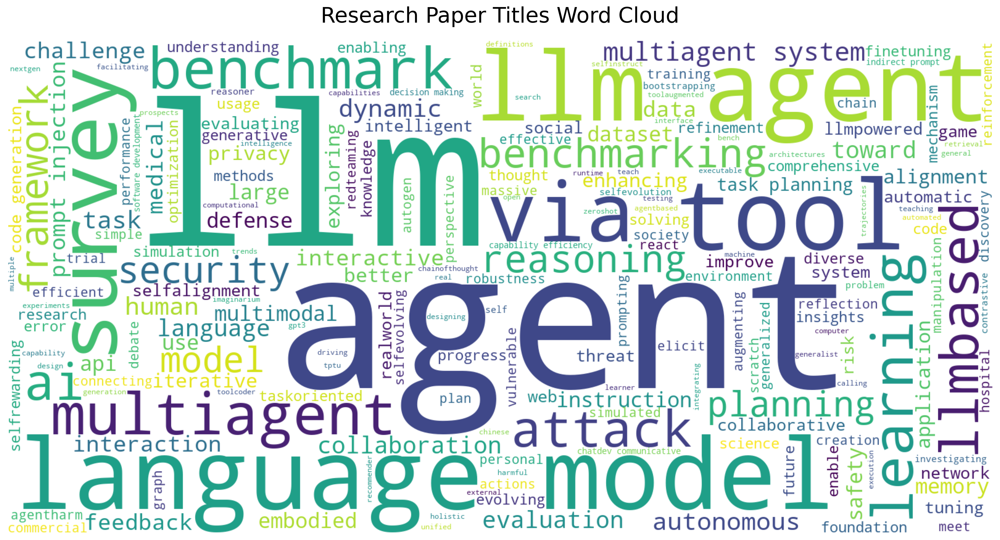
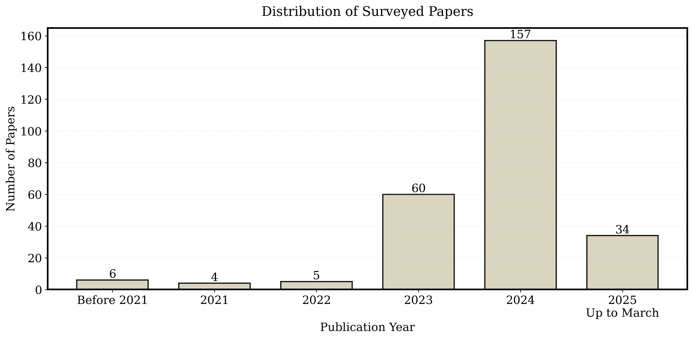

# LLM Agent Research Collection

This repository contains a comprehensive collection of research papers on Large Language Model (LLM) agents. We organize papers across key categories including agent construction, collaboration mechanisms, evolution, tools, security, benchmarks, and applications. Our taxonomy provides a structured framework for understanding the rapidly evolving field of LLM agents, from architectural foundations to practical implementations.

The collection aims to bridge fragmented research threads by highlighting connections between agent design principles and emergent behaviors. Whether you're a researcher, practitioner, or enthusiast, this curated list offers a valuable resource for navigating the landscape of intelligent agent systems powered by large language models.

## Overview of LLM Agent Ecosystem

This repository contains comprehensive resources for our survey on LLM-based agents. The survey systematically deconstructs LLM agent systems through a methodology-centered taxonomy, connecting architectural foundations, collaboration mechanisms, and evolutionary pathways.



## Survey Timeline and Scope

Our survey covers the rapidly evolving field of LLM agents, with a significant increase in research publications since 2023.



## Paper Collection

| Title | Category | Year | url |
| --- | --- | --- | --- |
| Large Model Based Agents: State-of-the-Art, Cooperation Paradigms, Security and Privacy, and Future Trends  | Introduction | 2024 | [link](https://arxiv.org/abs/2409.14457) |
| Agent AI: Surveying the Horizons of Multimodal Interaction | Introduction | 2024 | [link](https://arxiv.org/abs/2401.03568) |
| Large Language Model based Multi-Agents: A Survey of Progress and Challenges | Introduction | 2024 | [link](https://arxiv.org/abs/2402.01680) |
| A survey on large language model based autonomous agents | Introduction | 2023 | [link](https://arxiv.org/abs/2308.11432) |
| The rise and potential of large language model based agents: a survey | Introduction | 2023 | [link](https://arxiv.org/abs/2309.07864) |
| Large Multimodal Agents: A Survey | Introduction | 2024 | [link](https://arxiv.org/abs/2402.15116) |
| Understanding the planning of LLM agents: A survey | Introduction | 2024 | [link](https://arxiv.org/abs/2402.02716) |
| Computational Experiments Meet Large Language Model Based Agents: A Survey and Perspective | Introduction | 2024 | [link](https://arxiv.org/abs/2402.00262) |
| Personal LLM Agents: Insights and Survey about the Capability, Efficiency and Security | Introduction | 2024 | [link](https://arxiv.org/abs/2401.05459) |
| Large Model Based Agents: State-of-the-Art, Cooperation Paradigms, Security and Privacy, and Future Trends | Introduction | 2024 | [link](https://arxiv.org/abs/2409.14457) |
| The Landscape of Emerging AI Agent Architectures for Reasoning, Planning, and Tool Calling: A Survey | Introduction | 2024 | [link](https://arxiv.org/abs/2404.11584) |
| Exploring Large Language Model based Intelligent Agents: Definitions, Methods, and Prospects | Introduction | 2024 | [link](https://arxiv.org/abs/2401.03428) |
| Position Paper: Agent AI Towards a Holistic Intelligence | Introduction | 2024 | [link](https://arxiv.org/abs/2403.00833) |
| AgentBench: Evaluating LLMs as Agents | Datasets & Benchmarks | 2024 | [link](https://openreview.net/pdf?id=zAdUB0aCTQ) |
| AgentHarm: Benchmarking Robustness of LLM Agents on Harmful Tasks | Datasets & Benchmarks | 2025 | [link](https://openreview.net/pdf?id=AC5n7xHuR1) |
| AgentQuest: A Modular Benchmark Framework to Measure Progress and Improve LLM Agents | Datasets & Benchmarks | 2024 | [link](https://aclanthology.org/2024.naacl-demo.19.pdf) |
| AI Hospital: Benchmarking Large Language Models in a Multi-agent Medical Interaction Simulator | Datasets & Benchmarks | 2025 | [link](https://aclanthology.org/2025.coling-main.680.pdf) |
| BENCHAGENTS: Automated Benchmark Creation with Agent Interaction | Datasets & Benchmarks | 2024 | [link](https://arxiv.org/pdf/2410.22584) |
| Benchmark Self-Evolving: A Multi-Agent Framework for Dynamic LLM Evaluation | Datasets & Benchmarks | 2025 | [link](https://aclanthology.org/2025.coling-main.223.pdf) |
| Benchmarking Data Science Agents | Datasets & Benchmarks | 2024 | [link](https://aclanthology.org/2024.acl-long.308.pdf) |
| Benchmarking Large Language Models as AI Research Agents | Datasets & Benchmarks | 2024 | [link](https://openreview.net/pdf?id=N9wD4RFWY0) |
| Benchmarking Large Language Models for Multi-agent Systems: A Comparative Analysis of AutoGen, CrewAI, and TaskWeaver | Datasets & Benchmarks | 2024 | [link](https://link.springer.com/chapter/10.1007/978-3-031-70415-4_4) |
| BLADE- Benchmarking Language Model Agents | Datasets & Benchmarks | 2024 | [link](https://aclanthology.org/2024.findings-emnlp.815.pdf) |
| CRAB: Cross-platfrom agent benchmark for multi-modal embodied language model agents | Datasets & Benchmarks | 2024 | [link](https://openreview.net/pdf?id=kyExS4V0H7) |
| CToolEval: A Chinese Benchmark for LLM-Powered Agent Evaluation in Real-World API Interactions | Datasets & Benchmarks | 2024 | [link](https://aclanthology.org/2024.findings-acl.928.pdf) |
| DA-Code: Agent Data Science Code Generation Benchmark for Large Language Models | Datasets & Benchmarks | 2024 | [link](https://aclanthology.org/2024.emnlp-main.748.pdf) |
| DCA-Bench: A Benchmark for Dataset Curation Agents | Datasets & Benchmarks | 2025 | [link](https://openreview.net/pdf?id=a4sknPttwV) |
| Embodied Agent Interface: Benchmarking LLMs for Embodied Decision Making | Datasets & Benchmarks | 2024 | [link](https://proceedings.neurips.cc/paper_files/paper/2024/hash/b631da756d1573c24c9ba9c702fde5a9-Abstract-Datasets_and_Benchmarks_Track.html) |
| GTA: A Benchmark for General Tool Agents | Datasets & Benchmarks | 2024 | [link](https://proceedings.neurips.cc/paper_files/paper/2024/file/8a75ee6d4b2eb0b777f549a32a5a5c28-Paper-Datasets_and_Benchmarks_Track.pdf) |
| LaMPilot: An Open Benchmark Dataset for Autonomous Driving with Language Model Programs | Datasets & Benchmarks | 2024 | [link](http://javascript:void()) |
| MedAgentBench: A Realistic Virtual EHR Environment to Benchmark Medical LLM Agents | Datasets & Benchmarks | 2025 | [link](https://arxiv.org/pdf/2501.14654) |
| ML Research Benchmark | Datasets & Benchmarks | 2024 | [link](https://arxiv.org/pdf/2410.22553) |
| MLE-Bench: Evaluating Machine Learning Agents on Machine Learning Engineering | Datasets & Benchmarks | 2025 | [link](https://openreview.net/pdf?id=6s5uXNWGIh) |
| MMAU: A Holistic Benchmark of Agent Capabilities Across Diverse Domains | Datasets & Benchmarks | 2024 | [link](https://arxiv.org/pdf/2407.18961) |
| OmniACT: A Dataset and Benchmark for Enabling Multimodal Generalist Autonomous Agents for Desktop and Web | Datasets & Benchmarks | 2024 | [link](https://arxiv.org/pdf/2402.17553) |
| OSWorld: Benchmarking Multimodal Agents for Open-Ended Tasks in Real Computer Environments | Datasets & Benchmarks | 2024 | [link](https://proceedings.neurips.cc/paper_files/paper/2024/file/5d413e48f84dc61244b6be550f1cd8f5-Paper-Datasets_and_Benchmarks_Track.pdf) |
| Revisiting Benchmark and Assessment: An Agent-based Exploratory Dynamic Evaluation Framework for LLMs | Datasets & Benchmarks | 2024 | [link](https://arxiv.org/pdf/2410.11507) |
| Seal-Tools: Self-instruct Tool Learning Dataset for Agent Tuning and Detailed Benchmark | Datasets & Benchmarks | 2024 | [link](https://arxiv.org/pdf/2405.08355) |
| Tapilot-Crossing: Benchmarking and Evolving LLMs Towards Interactive Data Analysis Agents | Datasets & Benchmarks | 2024 | [link](https://arxiv.org/pdf/2403.05307) |
| TheAgentCompany: Benchmarking LLM Agents on Consequential Real World Tasks | Datasets & Benchmarks | 2024 | [link](https://arxiv.org/pdf/2412.14161) |
| Tur[k]ingBench: A Challenge Benchmark for Web Agents | Datasets & Benchmarks | 2024 | [link](https://arxiv.org/pdf/2403.11905) |
| Benchmark Evaluations, Applications, and Challenges of Large Vision Language Models: A Survey | Datasets & Benchmarks | 2025 | [link](https://arxiv.org/pdf/2501.02189) |
| Large Language Model based Multi-Agents: A Survey of Progress and Challenges | Datasets & Benchmarks | 2024 | [link](https://www.ijcai.org/proceedings/2024/0890.pdf) |
| Agent-FLAN: Designing Data and Methods of Effective Agent Tuning for Large Language Models | Datasets & Benchmarks | 2024 | [link](https://aclanthology.org/2024.findings-acl.557/) |
| AgentBank: Towards Generalized LLM Agents via Fine-Tuning on 50000+ Interaction Trajectories | Datasets & Benchmarks | 2024 | [link](https://aclanthology.org/2024.findings-emnlp.116/) |
| AgentOhana: Design Unified Data and Training Pipeline for Effective Agent Learning | Datasets & Benchmarks | 2024 | [link](http://arxiv.org/abs/2402.15506) |
| AgentTuning: Enabling Generalized Agent Abilities for LLMs | Datasets & Benchmarks | 2024 | [link](https://aclanthology.org/2024.findings-acl.181/) |
| Executable Code Actions Elicit Better LLM Agents | Datasets & Benchmarks | 2024 | [link](https://proceedings.mlr.press/v235/wang24h.html) |
| FireAct: Toward Language Agent Fine-tuning | Datasets & Benchmarks | 2023 | [link](http://arxiv.org/abs/2310.05915) |
| Multi-Agent Collaboration: Harnessing the Power of Intelligent LLM Agents | Tools | 2023 | [link](http://arxiv.org/abs/2306.03314) |
| Re-Invoke: Tool Invocation Rewriting for Zero-Shot Tool Retrieval | Tools | 2024 | [link](http://arxiv.org/abs/2408.01875) |
| Recommender AI Agent: Integrating Large Language Models for Interactive Recommendations | Tools | 2023 | [link](http://arxiv.org/abs/2308.16505) |
| Chain of Tools: Large Language Model is an Automatic Multi-tool Learner | Tools | 2024 | [link](http://arxiv.org/abs/2405.16533) |
| EASYTOOL: Enhancing LLM-based Agents with Concise Tool Instruction | Tools | 2024 | [link](http://arxiv.org/abs/2401.06201) |
| LLM With Tools: A Survey | Tools | 2024 | [link](http://arxiv.org/abs/2409.18807) |
| ToolGen: Unified Tool Retrieval and Calling via Generation | Tools | 2024 | [link](http://arxiv.org/abs/2410.03439) |
| ToolLLM: Facilitating Large Language Models to Master 16000+ Real-world APIs | Tools | 2023 | [link](http://arxiv.org/abs/2307.16789) |
| ToolNet: Connecting Large Language Models with Massive Tools via Tool Graph | Tools | 2024 | [link](http://arxiv.org/abs/2403.00839) |
| ToolPlanner: A Tool Augmented LLM for Multi Granularity Instructions with Path Planning and Feedback | Tools | 2024 | [link](http://arxiv.org/abs/2409.14826) |
| TPTU-v2: Boosting Task Planning and Tool Usage of Large Language Model-based Agents in Real-world Systems | Tools | 2023 | [link](http://arxiv.org/abs/2311.11315) |
| TPTU: Large Language Model-based AI Agents for Task Planning and Tool Usage | Tools | 2023 | [link](http://arxiv.org/abs/2308.03427) |
| GPT4Tools: Teaching Large Language Model to Use Tools via Self-instruction | Tools | 2023 | [link](https://proceedings.neurips.cc/paper_files/paper/2023/hash/e393677793767624f2821cec8bdd02f1-Abstract-Conference.html?utm_campaign=Artificial%2BIntelligence%2BWeekly&utm_medium=email&utm_source=Artificial_Intelligence_Weekly_411) |
| Making Language Models Better Tool Learners with Execution Feedback | Tools | 2024 | [link](https://aclanthology.org/2024.naacl-long.195/) |
| API-Bank: A Comprehensive Benchmark for Tool-Augmented LLMs | Tools | 2023 | [link](https://aclanthology.org/2023.emnlp-main.187/) |
| ChatCoT: Tool-Augmented Chain-of-Thought Reasoning on Chat-based Large Language Models | Tools | 2023 | [link](https://aclanthology.org/2023.findings-emnlp.985/) |
| ToolQA: A Dataset for LLM Question Answering with External Tools | Tools | 2023 | [link](https://proceedings.neurips.cc/paper_files/paper/2023/hash/9cb2a7495900f8b602cb10159246a016-Abstract-Datasets_and_Benchmarks.html) |
| On the Tool Manipulation Capability of Open-source Large Language Models | Tools | 2023 | [link](http://arxiv.org/abs/2305.16504) |
| RestGPT: Connecting Large Language Models with Real-World RESTful APIs | Tools | 2023 | [link](http://arxiv.org/abs/2306.06624) |
| Leveraging Large Language Models to Improve REST API Testing | Tools | 2024 | [link](https://dl.acm.org/doi/10.1145/3639476.3639769) |
| Toolformer: Language Models Can Teach Themselves to Use Tools | Tools | 2023 | [link](https://proceedings.neurips.cc/paper_files/paper/2023/hash/d842425e4bf79ba039352da0f658a906-Abstract-Conference.html) |
| WebGPT: Browser-assisted question-answering with human feedback | Tools | 2022 | [link](http://arxiv.org/abs/2112.09332) |
| WebCPM: Interactive Web Search for Chinese Long-form Question Answering | Tools | 2023 | [link](https://aclanthology.org/2023.acl-long.499/) |
| ToolCoder: Teach Code Generation Models to use API search tools | Tools | 2023 | [link](http://arxiv.org/abs/2305.04032) |
| ToolCoder: A Systematic Code-Empowered Tool Learning Framework for Large Language Models | Tools | 2025 | [link](http://arxiv.org/abs/2502.11404) |
| ToolAlpaca: Generalized Tool Learning for Language Models with 3000 Simulated Cases | Tools | 2023 | [link](http://arxiv.org/abs/2306.05301) |
| LLMs in the Imaginarium: Tool Learning through Simulated Trial and Error | Tools | 2024 | [link](https://aclanthology.org/2024.acl-long.570/) |
| Skills-in-Context: Unlocking Compositionality in Large Language Models | Tools | 2024 | [link](https://aclanthology.org/2024.findings-emnlp.812/) |
| Task Bench: A Parameterized Benchmark for Evaluating Parallel Runtime Performance | Tools | 2020 | [link](https://www.computer.org/csdl/proceedings-article/sc/2020/999800a864/1oeOToMWZBC) |
| ToolkenGPT: Augmenting Frozen Language Models with Massive Tools via Tool Embeddings | Tools | 2023 | [link](https://proceedings.neurips.cc/paper_files/paper/2023/hash/8fd1a81c882cd45f64958da6284f4a3f-Abstract-Conference.html) |
| MultiTool-CoT: GPT-3 Can Use Multiple External Tools with Chain of Thought Prompting | Tools | 2023 | [link](https://aclanthology.org/2023.acl-short.130/) |
| TaskMatrix.AI: Completing Tasks by Connecting Foundation Models with Millions of APIs | Tools | 2024 | [link](https://spj.science.org/doi/10.34133/icomputing.0063) |
| Gorilla: Large Language Model Connected with Massive APIs | Tools | 2024 | [link](https://proceedings.neurips.cc/paper_files/paper/2024/hash/e4c61f578ff07830f5c37378dd3ecb0d-Abstract-Conference.html) |
| CREATOR: Tool Creation for Disentangling Abstract and Concrete Reasoning of Large Language Models | Tools | 2023 | [link](https://aclanthology.org/2023.findings-emnlp.462/) |
| LARGE LANGUAGE MODELS AS TOOL MAKERS | Tools | 2024 | [link](https://arxiv.org/abs/2305.17126) |
| GEAR: Augmenting Language Models with Generalizable and Efficient Tool Resolution | Tools | 2023 | [link](https://arxiv.org/pdf/2307.08775) |
| CAMEL: Communicative Agents for "Mind" Exploration of Large Language Model Society | Agent Construction | 2023 | [link](https://arxiv.org/abs/2303.17760) |
| AutoGen: Enabling Next-Gen LLM Applications via Multi-Agent Conversation | Agent Construction | 2023 | [link](https://arxiv.org/abs/2308.08155) |
| AutoAgents: A Framework for Automatic Agent Generation | Agent Construction | 2024 | [link](https://arxiv.org/abs/2309.17288) |
| MetaGPT: Meta Programming for A Multi-Agent Collaborative Framework | Agent Construction | 2024 | [link](https://arxiv.org/abs/2308.00352) |
| Cognitive Architectures for Language Agents | Agent Construction | 2024 | [link](https://arxiv.org/abs/2309.02427) |
| Executable Code Actions Elicit Better LLM Agents | Agent Construction | 2024 | [link](https://arxiv.org/abs/2402.01030) |
| ChatDev: Communicative Agents for Software Development | Agent Construction | 2024 | [link](https://arxiv.org/abs/2307.07924) |
| Editable Scene Simulation for Autonomous Driving via Collaborative LLM-Agents | Agent Construction | 2024 | [link](https://openaccess.thecvf.com/content/CVPR2024/papers/Wei_Editable_Scene_Simulation_for_Autonomous_Driving_via_Collaborative_LLM-Agents_CVPR_2024_paper.pdf) |
| A Dynamic LLM-Powered Agent Network for Task-Oriented Agent Collaboration | Agent Construction | 2024 | [link](https://arxiv.org/abs/2310.02170) |
| AgentCoder: Multi-Agent-based Code Generation with Iterative Testing and Optimisation | Agent Construction | 2023 | [link](https://arxiv.org/abs/2312.13010) |
| More Agents Is All You Need | Agent Construction | 2024 | [link](https://arxiv.org/abs/2402.05120) |
| Agent Hospital: A Simulacrum of Hospital with Evolvable Medical Agents | Agent Construction | 2024 | [link](https://arxiv.org/abs/2405.02957) |
| Empowering biomedical discovery with AI agents | Agent Construction | 2024 | [link](https://www.cell.com/cell/fulltext/S0092-8674(24)01070-5?&target=_blank) |
| War and Peace (WarAgent): Large Language Model-based Multi-Agent Simulation of World Wars | Agent Construction | 2023 | [link](https://arxiv.org/abs/2311.17227) |
| A Survey on the Memory Mechanism of Large Language Model based Agents | Agent Construction | 2024 | [link](https://arxiv.org/abs/2404.13501) |
| Understanding the planning of LLM agents: A survey | Agent Construction | 2024 | [link](https://arxiv.org/abs/2402.02716) |
| SMART-LLM: Smart Multi-Agent Robot Task Planning using Large Language Models | Agent Construction | 2024 | [link](https://ieeexplore.ieee.org/abstract/document/10802322) |
| Planning with Multi-Constraints via Collaborative Language Agents | Agent Construction | 2025 | [link](https://aclanthology.org/2025.coling-main.672/) |
| Perceive, Reflect, and Plan: Designing LLM Agent for Goal-Directed City Navigation without Instructions | Agent Construction | 2024 | [link](http://arxiv.org/abs/2408.04168) |
| Enhancing the General Agent Capabilities of Low-Parameter LLMs through Tuning and Multi-Branch Reasoning | Agent Construction | 2024 | [link](https://arxiv.org/abs/2403.19962) |
| PlanCritic: Formal Planning with Human Feedback | Agent Construction | 2024 | [link](https://arxiv.org/abs/2412.00300) |
| Enhancing Robot Task Planning: Integrating Environmental Information and Feedback Insights through Large Language Models | Agent Construction | 2024 | [link](https://ieeexplore.ieee.org/abstract/document/10661782) |
| Devil's Advocate: Anticipatory Reflection for LLM Agents | Agent Construction | 2024 | [link](https://arxiv.org/abs/2405.16334) |
| Describe, Explain, Plan and Select: Interactive Planning with LLMs Enables Open-World Multi-Task Agents | Agent Construction | 2023 | [link](https://proceedings.neurips.cc/paper_files/paper/2023/hash/6b8dfb8c0c12e6fafc6c256cb08a5ca7-Abstract-Conference.html) |
| TPTU: Large Language Model-based AI Agents for Task Planning and Tool Usage | Agent Construction | 2023 | [link](https://arxiv.org/abs/2308.03427) |
| Planning, Creation, Usage: Benchmarking LLMs for Comprehensive Tool Utilization in Real-World Complex Scenarios | Agent Construction | 2024 | [link](https://arxiv.org/abs/2401.17167) |
| Embodied Agent Interface: Benchmarking LLMs for Embodied Decision Making | Agent Construction | 2025 | [link](https://proceedings.neurips.cc/paper_files/paper/2024/hash/b631da756d1573c24c9ba9c702fde5a9-Abstract-Datasets_and_Benchmarks_Track.html) |
| Application (Gaming) | Applications |  |  |
| Large Language Model based Multi-Agents: A Survey of Progress and Challenges | Applications | 2024 | [link](https://arxiv.org/pdf/2402.01680) |
| A Survey on Large Language Model-Based Game Agents | Applications | 2024 | [link](https://arxiv.org/pdf/2404.02039) |
| Large Language Models and Games: A Survey and Roadmap | Applications | 2024 | [link](https://arxiv.org/pdf/2402.18659) |
| Motif: Intrinsic Motivation from Artificial Intelligence Feedback | Applications | 2024 | [link](https://arxiv.org/pdf/2310.00166) |
| Describe, Explain, Plan and Select: Interactive Planning with Large Language Models Enables Open-World Multi-Task Agents  | Applications | 2023 | [link](https://arxiv.org/pdf/2302.01560) |
| Language Models as Zero-Shot Planners: Extracting Actionable Knowledge for Embodied Agents | Applications | 2022 | [link](https://proceedings.mlr.press/v162/huang22a.html) |
| Language Models Meet World Models: Embodied Experiences Enhance Language Models | Applications | 2023 | [link](https://arxiv.org/abs/2305.10626.pdf) |
| ChessGPT: Bridging Policy Learning and Language Modeling | Applications | 2023 | [link](https://proceedings.neurips.cc/paper_files/paper/2023/hash/16b14e3f288f076e0ca73bdad6405f77-Abstract-Datasets_and_Benchmarks.html) |
| Mindagent: Emergent gaming interaction | Applications | 2023 | [link](https://arxiv.org/pdf/2309.09971) |
| Exploring large language models for communication games: An empirical study on Werewolf | Applications | 2023 | [link](https://arxiv.org/abs/2309.04658) |
| Baba Is AI: Break the Rules to Beat the Benchmark | Applications | 2024 | [link](https://arxiv.org/pdf/2407.13729) |
| Language as reality: a co-creative storytelling game experience in 1001 nights using generative AI | Applications | 2023 | [link](https://ojs.aaai.org/index.php/AIIDE/article/view/27539) |
| Application (Social Science) | Applications |  |  |
| Large language model-empowered agents for simulating macroeconomic activities | Applications | 2024 | [link](https://aclanthology.org/2024.acl-long.829/) |
| TradingGPT: Multi-Agent System with Layered Memory and Distinct Characters for Enhanced Financial Trading Performance | Applications | 2023 | [link](https://arxiv.org/abs/2309.03736) |
| CompeteAI: Understanding the Competition Dynamics in Large Language Model-based Agents | Applications | 2024 | [link](https://arxiv.org/abs/2310.17512) |
| Understanding the benefits and challenges of using large language model-based conversational agents for mental well-being support | Applications | 2024 | [link](https://pmc.ncbi.nlm.nih.gov/articles/PMC10785945/) |
| Exploring Collaboration Mechanisms for LLM Agents | Applications | 2024 | [link](https://aclanthology.org/2024.acl-long.782/) |
| Using large language models to simulate multiple humans and replicate human subject studies | Applications | 2023 | [link](https://proceedings.mlr.press/v202/aher23a/aher23a.pdf) |
| Generative Agents: Interactive Simulacra of Human Behavior | Applications | 2023 | [link](https://arxiv.org/abs/2304.03442) |
| Simulating Human Society with Large Language Model Agents: City, Social Media, and Economic System | Applications | 2024 | [link](https://dl.acm.org/doi/10.1145/3589335.3641253) |
| Can large language models transform computational social science? | Applications | 2024 | [link](https://aclanthology.org/2024.cl-1.8/) |
| Application (Productivity Tools ) | Applications |  |  |
| Exploring Large Language Model based Intelligent Agents: Definitions, Methods, and Prospects | Applications | 2024 | [link](https://arxiv.org/abs/2401.03428) |
| AgentCF: Collaborative Learning with Autonomous Language Agents for Recommender Systems | Applications | 2024 | [link](https://arxiv.org/pdf/2310.09233) |
| On Generative Agents in Recommendation | Applications | 2024 | [link](https://arxiv.org/abs/2310.10108) |
| Self-collaboration Code Generation via ChatGPT | Applications | 2023 | [link](https://arxiv.org/abs/2304.07590) |
| ChatDev: Communicative Agents for Software Development | Applications | 2024 | [link](https://aclanthology.org/2024.acl-long.810/) |
| Language models can solve computer tasks | Applications | 2023 | [link](https://openreview.net/pdf?id=M6OmjAZ4CX) |
| LLM-based Multi-Agent Systems: Techniques and Business Perspectives | Security | 2024 | [link](https://arxiv.org/pdf/2411.14033?) |
|   RTBAS: Defending LLM Agents Against Prompt Injection and Privacy Leakage | Security | 2025 | [link](https://arxiv.org/pdf/2502.08966) |
|   BlockAgents: Towards Byzantine-Robust LLM-Based Multi-Agent Coordination via Blockchain | Security | 2024 | [link](https://dl.acm.org/doi/pdf/10.1145/3674399.3674445) |
| PROMPT INFECTION: LLM-TO-LLM PROMPT INJECTION WITHIN MULTI-AGENT SYSTEMS | Security | 2024 | [link](https://arxiv.org/pdf/2410.07283) |
|   AgentDojo: A Dynamic Environment to Evaluate Prompt Injection Attacks and Defenses for LLM Agents | Security | 2024 | [link](https://openreview.net/pdf?id=m1YYAQjO3w) |
|   AGENTPOISON: Red-teaming LLM Agents via Poisoning Memory or Knowledge Bases | Security | 2024 | [link](https://proceedings.neurips.cc/paper_files/paper/2024/file/eb113910e9c3f6242541c1652e30dfd6-Paper-Conference.pdf) |
|   AutoDefense: Multi-Agent LLM Defense against Jailbreak Attacks | Security | 2024 | [link](https://arxiv.org/pdf/2403.04783) |
|   Red-Teaming LLM Multi-Agent Systems via Communication Attacks | Security | 2025 | [link](https://arxiv.org/pdf/2502.14847) |
| Imprompter- Tricking LLM Agents into Improper Tool Use | Security | 2024 | [link](https://arxiv.org/pdf/2410.14923) |
|   TARGETING THE CORE: A SIMPLE AND EFFECTIVE METHOD TO ATTACK RAG-BASED AGENTS VIA DIRECT LLM MANIPULATION | Security | 2024 | [link](https://arxiv.org/pdf/2412.04415) |
|   Unveiling Privacy Risks in LLM Agent Memory | Security | 2025 | [link](https://arxiv.org/abs/2502.13172) |
|   Prompt Injection as a Defense Against LLM-driven Cyberattacks | Security | 2024 | [link](https://arxiv.org/pdf/2410.20911) |
|   Evil Geniuses: Delving into the Safety of LLM-based Agents | Security | 2024 | [link](https://arxiv.org/pdf/2311.11855) |
| AGENT SECURITY BENCH (ASB): FORMALIZING AND BENCHMARKING ATTACKS AND DEFENSES IN LLM-BASED AGENTS | Security | 2024 | [link](https://arxiv.org/pdf/2410.02644?) |
|   AGENTHARM: A BENCHMARK FOR MEASURING HARMFULNESS OF LLM AGENTS | Security | 2024 | [link](https://arxiv.org/pdf/2410.09024) |
|   CLAS 2024: The Competition for LLM and Agent Safety | Security | 2024 | [link](https://openreview.net/pdf?id=GIDw94AlZK) |
| Navigating the Risks: A Survey of Security, Privacy, and Ethics Threats in LLM-Based Agents | Security | 2024 | [link](https://arxiv.org/pdf/2411.09523?) |
|   Security of AI Agents | Security | 2024 | [link](https://arxiv.org/pdf/2406.08689) |
|   PERSONAL LLM AGENTS: INSIGHTS AND SURVEY ABOUT THE CAPABILITY, EFFICIENCY AND SECURITY | Security | 2024 | [link](https://arxiv.org/pdf/2401.05459) |
| The Emerged Security and Privacy of LLM Agent: A Survey with Case Studies | Security | 2024 | [link](https://arxiv.org/pdf/2407.19354) |
|   Commercial LLM Agents Are Already Vulnerable to Simple Yet Dangerous Attacks | Security | 2025 | [link](https://arxiv.org/pdf/2502.08586) |
| AEIA-MN: Evaluating the Robustness of Multimodal LLM-Powered Mobile Agents Against Active Environmental Injection Attacks | Security | 2025 | [link](https://arxiv.org/pdf/2502.13053) |
|   The Task Shield: Enforcing Task Alignment to Defend Against Indirect Prompt Injection in LLM Agents | Security | 2024 | [link](https://arxiv.org/pdf/2412.16682) |
|   WIPI: A New Web Threat for LLM-Driven Web Agents | Security | 2024 | [link](https://arxiv.org/pdf/2402.16965) |
|   Agent Smith: A Single Image Can Jailbreak One Million Multimodal LLM Agents Exponentially Fast | Security | 2024 | [link](https://arxiv.org/abs/2402.08567) |
|   Firewalls to Secure Dynamic LLM Agentic Networks | Security | 2025 | [link](https://arxiv.org/pdf/2502.01822) |
|   CORBA: Contagious Recursive Blocking Attacks on Multi-Agent Systems Based on Large Language Models | Security | 2024 | [link](https://arxiv.org/pdf/2502.14529) |
|   AUTOHIJACKER: AUTOMATIC INDIRECT PROMPT INJECTION AGAINST BLACK-BOX LLM AGENTS | Security | 2025 | [link](https://openreview.net/pdf?id=2VmB01D9Ef) |
|   PsySafe: A Comprehensive Framework for Psychological-based Attack, Defense, and Evaluation of Multi-agent System Safety | Security | 2024 | [link](https://aclanthology.org/2024.acl-long.812/) |
|   Breaking ReAct Agents: Foot-in-the-Door Attack Will Get You In | Security | 2024 | [link](https://arxiv.org/pdf/2410.16950) |
|   AGENT-SAFETYBENCH: Evaluating the Safety of LLM Agents | Security | 2024 | [link](https://arxiv.org/pdf/2412.14470) |
|   INJECAGENT: Benchmarking Indirect Prompt Injections in Tool-Integrated Large Language Model Agents | Security | 2024 | [link](https://arxiv.org/pdf/2403.02691) |
|   AI Agents Under Threat: A Survey of Key Security Challenges and Future Pathways | Security | 2025 | [link](https://dl.acm.org/doi/pdf/10.1145/3716628) |
| Multi-Agent Collaboration Mechanisms: A Survey of LLMs | Agent Collaboration | 2025 | [link](https://arxiv.org/pdf/2501.06322) |
| Inferring the Goals of Communicating Agents from Actions and Instructions | Agent Collaboration | 2024 | [link](https://arxiv.org/abs/2306.16207) |
| AutoGen: Enabling Next-Gen LLM Applications via Multi-Agent Conversation | Agent Collaboration | 2023 | [link](https://arxiv.org/abs/2308.08155) |
| Adaptive Collaboration Strategy for LLMs in Medical Decision Making | Agent Collaboration | 2024 | [link](https://arxiv.org/abs/2404.15155) |
| Improving Factuality and Reasoning in Language Models through Multiagent Debate | Agent Collaboration | 2023 | [link](https://arxiv.org/abs/2305.14325) |
| ReConcile: Round-Table Conference Improves Reasoning via Consensus among Diverse LLMs | Agent Collaboration | 2024 | [link](https://arxiv.org/abs/2309.13007) |
| Autonomous chemical research with large language models | Agent Collaboration | 2023 | [link](https://www.nature.com/articles/s41586-023-06792-0) |
| MetaGPT: Meta Programming for A Multi-Agent Collaborative Framework | Agent Collaboration | 2024 | [link](https://arxiv.org/abs/2308.00352) |
| Debating with More Persuasive LLMs Leads to More Truthful Answers | Agent Collaboration | 2024 | [link](https://arxiv.org/abs/2402.06782) |
| Roco: Dialectic multi-robot collaboration with large language models | Agent Collaboration | 2024 | [link](https://arxiv.org/abs/2307.04738) |
| AutoAct: Automatic Agent Learning from Scratch for QA via Self-Planning | Agent Collaboration | 2024 | [link](https://arxiv.org/abs/2401.05268) |
| Meta-Prompting: Enhancing Language Models with Task-Agnostic Scaffolding | Agent Collaboration | 2024 | [link](https://arxiv.org/abs/2401.12954) |
| Encouraging Divergent Thinking in Large Language Models through Multi-Agent Debate | Agent Collaboration | 2024 | [link](https://arxiv.org/abs/2305.19118) |
| AgentVerse: Facilitating Multi-Agent Collaboration and Exploring Emergent Behaviors | Agent Collaboration | 2024 | [link](https://openreview.net/forum?id=EHg5GDnyq1) |
| Dynamic LLM-Powered Agent Network for Task-Oriented Agent Collaboration | Agent Collaboration | 2024 | [link](https://arxiv.org/abs/2310.02170) |
| ChatDev: Communicative Agents for Software Development | Agent Collaboration | 2024 | [link](https://arxiv.org/abs/2307.07924) |
| ChatEval: Towards Better LLM-based Evaluators through Multi-Agent Debate | Agent Collaboration | 2024 | [link](https://openreview.net/forum?id=FQepisCUWu) |
| A Dynamic LLM-Powered Agent Network for Task-Oriented Agent Collaboration | Methodology | 2024 | [link](https://openreview.net/forum?id=XII0Wp1XA9#discussion) |
| ChemCrow: Augmenting large-language models with chemistry tools | Applications | 2023 | [link](https://arxiv.org/abs/2304.05376) |
| CRISPR-GPT: An LLM Agent for Automated Design of Gene-Editing Experiments | Applications | 2024 | [link](https://arxiv.org/abs/2404.18021) |
| SciAgents: Automating Scientific Discovery Through Bioinspired Multi-Agent Intelligent Graph Reasoning | Applications | 2024 | [link](https://advanced.onlinelibrary.wiley.com/doi/full/10.1002/adma.202413523) |
| AlphaFlow: autonomous discovery and optimization of multi-step chemistry using a self-driven fluidic lab guided by reinforcement learning | Applications | 2023 | [link](https://www.nature.com/articles/s41467-023-37139-y) |
| An active inference strategy for prompting reliable responses from large language models in medical practice | Applications | 2025 | [link](https://doi.org/10.1038/s41746-025-01516-2) |
| An evaluation framework for clinical use of large language models in patient interaction tasks | Applications | 2025 | [link](https://doi.org/10.1038/s41591-024-03328-5) |
| Stress-testing the resilience of the Austrian healthcare system using agent-based simulation | Applications | 2022 | [link](https://doi.org/10.1038/s41467-022-31766-7) |
| Medical large language models are susceptible to targeted misinformation attacks | Applications | 2024 | [link](https://doi.org/10.1038/s41746-024-01282-7) |
| Large Language Models lack essential metacognition for reliable medical reasoning | Applications | 2025 | [link](https://doi.org/10.1038/s41467-024-55628-6) |
| Balancing autonomy and expertise in autonomous synthesis laboratories | Applications | 2025 | [link](https://doi.org/10.1038/s43588-025-00769-x) |
| Agent Attacks or Security |  |  |  |
| DemonAgent: Dynamically Encrypted Multi-Backdoor Implantation Attack on LLM-based Agent  | Security |  | [link](https://arxiv.org/abs/2502.12575) |
| Personal LLM Agents: Insights and Survey about the Capability, Efficiency and Security | Security |  | [link](https://arxiv.org/abs/2401.05459) |
| CORBA: Contagious Recursive Blocking Attacks on Multi-Agent Systems Based on Large Language Models  | Security |  | [link](https://arxiv.org/abs/2502.14529) |
| G-Safeguard: A Topology-Guided Security Lens and Treatment on LLM-based Multi-agent Systems  | Security |  | [link](https://arxiv.org/abs/2502.11127) |
| AgentHarm: Benchmarking Robustness of LLM Agents on Harmful Tasks | Security |  | [link](https://openreview.net/forum?id=AC5n7xHuR1) |
| Commercial LLM Agents Are Already Vulnerable to Simple Yet Dangerous Attacks  | Security |  | [link](https://arxiv.org/abs/2502.08586) |
| PsySafe: A Comprehensive Framework for Psychological-based Attack, Defense, and Evaluation of Multi-agent System Safety  | Security |  | [link](https://arxiv.org/abs/2401.11880) |
| TrustAgent: Towards Safe and Trustworthy LLM-based Agents  | Security |  | [link](https://arxiv.org/abs/2402.01586) |
| AI Agents Under Threat: A Survey of Key Security Challenges and Future Pathways | Security |  | [link](https://dl.acm.org/doi/abs/10.1145/3716628) |
| Watch Out for Your Agents! Investigating Backdoor Threats to LLM-Based Agents  | Security |  | [link](https://proceedings.neurips.cc/paper_files/paper/2024/hash/b6e9d6f4f3428cd5f3f9e9bbae2cab10-Abstract-Conference.html) |
| R-Judge: Benchmarking Safety Risk Awareness for LLM Agents  | Security |  | [link](https://arxiv.org/abs/2401.10019) |
| Recent advancements in LLM Red-Teaming: Techniques, Defenses, and Ethical Considerations  | Security |  | [link](https://arxiv.org/abs/2410.09097) |
| NetSafe: Exploring the Topological Safety of Multi-agent Networks  | Security |  | [link](https://arxiv.org/abs/2410.15686) |
| A Trembling House of Cards? Mapping Adversarial Attacks against Language Agents  | Security |  | [link](https://arxiv.org/abs/2402.10196) |
| Prompt Infection: LLM-to-LLM Prompt Injection within Multi-Agent Systems | Security |  |  |
| Dify | Tools |  | [link](https://github.com/langgenius/dify) |
| LangChian | Tools |  | [link](https://github.com/langchain-ai/langchain) |
| Ethical and social risks of harm from Language Models | Ethics | 2021 | [link](https://arxiv.org/abs/2112.04359) |
| On the Dangers of Stochastic Parrots: Can Language Models Be Too Big? 🦜  | Ethics | 2021 | [link](https://dl.acm.org/doi/10.1145/3442188.3445922) |
| Medical large language models are vulnerable to data-poisoning attacks  | Ethics | 2025 | [link](https://www.nature.com/articles/s41591-024-03445-1) |
| On the Opportunities and Risks of Foundation Models | Ethics | 2021 | [link](https://arxiv.org/abs/2108.07258) |
| Deconstructing The Ethics of Large Language Models from Long-standing Issues to New-emerging Dilemmas: A Surveyhttps://ui.adsabs.harvard.edu/ | Ethics | 2024 | [link](https://ui.adsabs.harvard.edu/abs/2024arXiv240605392D/abstract) |
| Toward Trustworthy AI Development: Mechanisms for Supporting Verifiable Claims | Ethics | 2020 | [link](https://arxiv.org/abs/2004.07213) |
| Process for Adapting Language Models to Society (PALMS) with Values-Targeted Datasets | Ethics | 2021 | [link](https://proceedings.neurips.cc/paper_files/paper/2021/hash/2e855f9489df0712b4bd8ea9e2848c5a-Abstract.html) |
| Predictability and Surprise in Large Generative Models | Ethics | 2022 | [link](https://dl.acm.org/doi/abs/10.1145/3531146.3533229) |
| Estimating the Carbon Footprint of BLOOM, a 176B Parameter Language Model | Ethics | 2023 | [link](https://www.jmlr.org/papers/v24/23-0069.html) |
| Foundation Models and Fair Use  | Ethics | 2024 | [link](https://www.jmlr.org/papers/v24/23-0569.html) |
| GPT-3: Its Nature, Scope, Limits, and Consequences | Ethics | 2020 | [link](https://link.springer.com/article/10.1007/s11023-020-09548-1) |
| Large Language Model Alignment: A Survey | Ethics | 2023 | [link](https://arxiv.org/abs/2309.15025) |
| LLaMA: Open and Efficient Foundation Language Models | Ethics | 2023 | [link](https://ai.meta.com/research/publications/llama-open-and-efficient-foundation-language-models/) |
| Energy and Policy Considerations for Modern Deep Learning Research | Ethics | 2020 | [link](https://ojs.aaai.org/index.php/AAAI/article/view/7123) |
| Actionable Auditing: Investigating the Impact of Publicly Naming Biased Performance Results of Commercial AI Products | Ethics | 2019 | [link](https://dl.acm.org/doi/abs/10.1145/3306618.3314244?casa_token=1ogqoO70pDgAAAAA:7r8-ICJ2Ym55Fg2aaW11gpz7FR15yYHzuqBdGu7ifBfkiMRdbknxo34ItX_GwjeUZPg9k4U22tRX) |
| Defending Against Neural Fake News | Ethics | 2019 | [link](https://proceedings.neurips.cc/paper/2019/hash/3e9f0fc9b2f89e043bc6233994dfcf76-Abstract.html) |
| Benchmark Self-Evolving: A Multi-Agent Framework for Dynamic LLM Evaluation | Agent Evolution | 2024 | [link](https://arxiv.org/pdf/2402.11443) |
| Agent-Pro: Learning to Evolve via Policy-Level Reflection and Optimization | Agent Evolution | 2024 | [link](https://aclanthology.org/2024.acl-long.292.pdf) |
| Coevolving with the Other You: Fine-Tuning LLM with Sequential Cooperative Multi-Agent Reinforcement Learning | Agent Evolution | 2024 | [link](https://proceedings.neurips.cc/paper_files/paper/2024/file/1c2b1c8f7d317719a9ce32dd7386ba35-Paper-Conference.pdf) |
| A Survey on Self-Evolution of Large Language Models | Agent Evolution | 2024 | [link](https://arxiv.org/pdf/2404.14387) |
| LLM-Evolve: Evaluation for LLM’s Evolving Capability on Benchmarks | Agent Evolution | 2024 | [link](https://aclanthology.org/2024.emnlp-main.940.pdf) |
| AlpacaFarm: A Simulation Framework for Methods that Learn from Human Feedback  | Agent Evolution | 2023 | [link](https://proceedings.neurips.cc/paper_files/paper/2023/file/5fc47800ee5b30b8777fdd30abcaaf3b-Paper-Conference.pdf) |
| SELF-REFINE:  Iterative Refinement with Self-Feedback  | Agent Evolution | 2023 | [link](https://openreview.net/pdf?id=S37hOerQLB) |
| Self-Evolution Learning for Discriminative Language Model Pretraining | Agent Evolution | 2023 | [link](https://aclanthology.org/2023.findings-acl.254.pdf) |
| CRITIC: Large Language Models Can Self-Correct with Tool-Interactive Critiquing | Agent Evolution | 2024 | [link](https://openreview.net/pdf?id=Sx038qxjek) |
| Iterative Translation Refinement with Large Language Models  | Agent Evolution | 2024 | [link](https://aclanthology.org/2024.eamt-1.17.pdf) |
| Evolutionary optimization of model merging recipes  | Agent Evolution | 2025 | [link](https://www.nature.com/articles/s42256-024-00975-8) |
| Agent Alignment in Evolving Social Norms  | Agent Evolution | 2024 | [link](https://arxiv.org/pdf/2401.04620) |
| Mitigating the Alignment Tax of RLHF  | Agent Evolution | 2024 | [link](https://aclanthology.org/2024.emnlp-main.35.pdf) |
| Self-Rewarding Language Models  | Agent Evolution | 2024 | [link](https://arxiv.org/pdf/2401.10020) |
| CREAM: Consistency Regularized Self-Rewarding Language Models | Agent Evolution | 2025 | [link](https://openreview.net/pdf?id=Vf6RDObyEF) |
| Self-Evolved Diverse Data Sampling for Efficient Instruction Tuning  | Agent Evolution |  |  |
| Principle-Driven Self-Alignment of Language Models from Scratch with Minimal Human Supervision  | Agent Evolution |  |  |
| Selective Reflection-Tuning: Student-Selected Data Recycling for LLM Instruction-Tuning  | Agent Evolution |  |  |
| V-STaR: Training Verifiers for Self-Taught Reasoners  | Agent Evolution |  |  |
| Step-On-Feet Tuning: Scaling Self-Alignment of LLMs via Bootstrapping  | Agent Evolution |  |  |
| SciInstruct: a Self-Reflective Instruction Annotated Dataset for Training Scientific Language Models  | Agent Evolution |  |  |
| Chain-of-Thought Prompting Elicits Reasoning in Large Language Models  | Agent Evolution |  |  |
| STaR: Self-Taught Reasoner Bootstrapping Reasoning With Reasoning  | Agent Evolution |  |  |
| SELFEVOLVE: A Code Evolution Framework via Large Language Models  | Agent Evolution |  |  |
| Think-in-Memory: Recalling and Post-thinking Enable LLMs with Long-Term Memory  | Agent Evolution |  |  |
| Failures Pave the Way: Enhancing Large Language Models through Tuning-free Rule Accumulation  | Agent Evolution |  |  |
| Large Language Models Can Self-Improve  | Agent Evolution |  |  |
| MoT: Memory-of-Thought Enables ChatGPT to Self-Improve  | Agent Evolution |  |  |
| React: Synergizing reasoning and acting in language models | Agent Evolution |  |  |
| Tree of Thoughts: Deliberate Problem Solving with Large Language Models  | Agent Evolution |  |  |
| MemoryBank: Enhancing Large Language Models with Long-Term Memory  | Agent Evolution |  |  |
| Graph of Thoughts: Solving Elaborate Problems with Large Language Models  | Agent Evolution |  |  |
| AUTOACT: Automatic Agent Learning from Scratch for QA via Self-Planning  | Agent Evolution |  |  |
| Debug like a Human: A Large Language Model Debugger via Verifying Runtime Execution Step by Step  | Agent Evolution |  |  |
| SOTOPIA-π: Interactive Learning of Socially Intelligent Language Agents  | Agent Evolution |  |  |
| Trial and Error: Exploration-Based Trajectory Optimization  | Agent Evolution |  |  |
| Bootstrapping LLM-based Task-Oriented Dialogue Agents via Self-Talk  | Agent Evolution |  |  |
| In-Memory Learning: A Declarative Learning Framework for Large Language Models  | Agent Evolution |  |  |
| MemGPT: Towards LLMs as Operating Systems  | Agent Evolution |  |  |
| ReAct Meets ActRe: Autonomous Annotation of Agent Trajectories for Contrastive Self-Training  | Agent Evolution |  |  |
| SALMON: Self-alignment with instructable reward models | Agent Evolution |  |  |
| Learning by Self-Explaining  | Agent Evolution |  |  |
| KnowAgent: Knowledge-Augmented Planning for LLM-Based Agents  | Agent Evolution |  |  |
| SOLID: Self-seeding and Multi-intent Self-instructing LLMs for Generating Intent-aware Information-Seeking Dialogs  | Agent Evolution |  |  |
| Can LLMs Learn from Previous Mistakes? Investigating LLMs’ Errors to Boost for Reasoning  | Agent Evolution |  |  |
| Direct Large Language Model Alignment Through Self-Rewarding Contrastive Prompt Distillation  | Agent Evolution |  |  |
| Large Language Models are Superpositions of All Characters: Attaining Arbitrary Role-play via Self-Alignment  | Agent Evolution |  |  |
| Self-Contrast: Better Reflection Through Inconsistent Solving Perspectives  | Agent Evolution |  |  |
| GRATH: Gradual Self-Truthifying for Large Language Models  | Agent Evolution |  |  |
| Self-Rewarding Language Models  | Agent Evolution |  |  |
| RLCD: Reinforcement learning from contrastive distillation for LM alignment | Agent Evolution |  |  |
| Self-Play Fine-Tuning Converts Weak Language Models to Strong Language Models  | Agent Evolution |  |  |
| Judging LLM-as-a-Judge with MT-Bench and Chatbot Arena  | Agent Evolution |  |  |
| SELF-REFINE:  Iterative Refinement with Self-Feedback  | Agent Evolution |  |  |
| Self-Alignment for Factuality: Mitigating Hallucinations in LLMs via Self-Evaluation  | Agent Evolution |  |  |
| LANGUAGE MODEL SELF-IMPROVEMENT BY REIN- FORCEMENT LEARNING CONTEMPLATION  | Agent Evolution |  |  |
| Reflexion: an autonomous agent with dynamic memory and self-reflection  | Agent Evolution |  |  |
| SELFEVOLVE: A Code Evolution Framework via Large Language Models  | Agent Evolution |  |  |
| RoboCat: A Self-Improving Generalist Agent for Robotic Manipulation  | Agent Evolution |  |  |
| LLMs in the Imaginarium:  Tool Learning through Simulated Trial and Error  | Agent Evolution |  |  |
| SInViG:  A Self-Evolving Interactive Visual Agent for Human-Robot Interaction  | Agent Evolution |  |  |
| CRITIC: LARGE LANGUAGE MODELS CAN SELF- CORRECT WITH TOOL-INTERACTIVE CRITIQUING  | Agent Evolution |  |  |
| TEACHING LARGE LANGUAGE MODELS TO SELF- DEBUG  | Agent Evolution |  |  |
| SELF-INSTRUCT: Aligning Language Models with Self-Generated Instructions  | Agent Evolution |  |  |
| Large Language Models are Better Reasoners with Self-Verification  | Agent Evolution |  |  |
| CODET: CODE GENERATION WITH GENERATED TESTS  | Agent Evolution |  |  |
| SELF-CONSISTENCY IMPROVES CHAIN OF THOUGHT REASONING IN LANGUAGE MODELS  | Agent Evolution |  |  |
| Beyond Human Data: Scaling Self-Training for Problem- Solving with Language Models  | Agent Evolution |  |  |
| Constitutional AI: Harmlessness from AI Feedback  | Agent Evolution |  |  |
| SELF: SELF-EVOLUTION WITH LANGUAGE FEED- BACK  | Agent Evolution |  |  |
| Self-Verification Improves Few-Shot Clinical Information Extraction  | Agent Evolution |  |  |
| Iterative Translation Refinement with Large Language Models  | Agent Evolution |  |  |
| ISR-LLM: Iterative Self-Refined Large Language Model for Long-Horizon Sequential Task Planning  | Agent Evolution |  |  |
| ProAgent: Building Proactive Cooperative Agents with Large Language Models  | Agent Evolution |  |  |
| Evolving Diverse Red-team Language Models in Multi-round Multi-agent Games  | Agent Evolution |  |  |
| Agent Planning with World Knowledge Model  | Agent Evolution |  |  |
| Refining Guideline Knowledge for Agent Planning Using Textgrad  | Agent Evolution |  |  |
## Citation

If you find our survey helpful, please consider citing our work:

```

```

## Contributing

We welcome contributions to expand our collection. You can:
- Submit a pull request to add papers or resources
- Open an issue to suggest additional papers or resources
- Submit your paper at https://forms.office.com/r/sW0Zzymi5b or email me at luo.junyu at outlook.com.

We will regularly update the repository and papers to include these articles.


